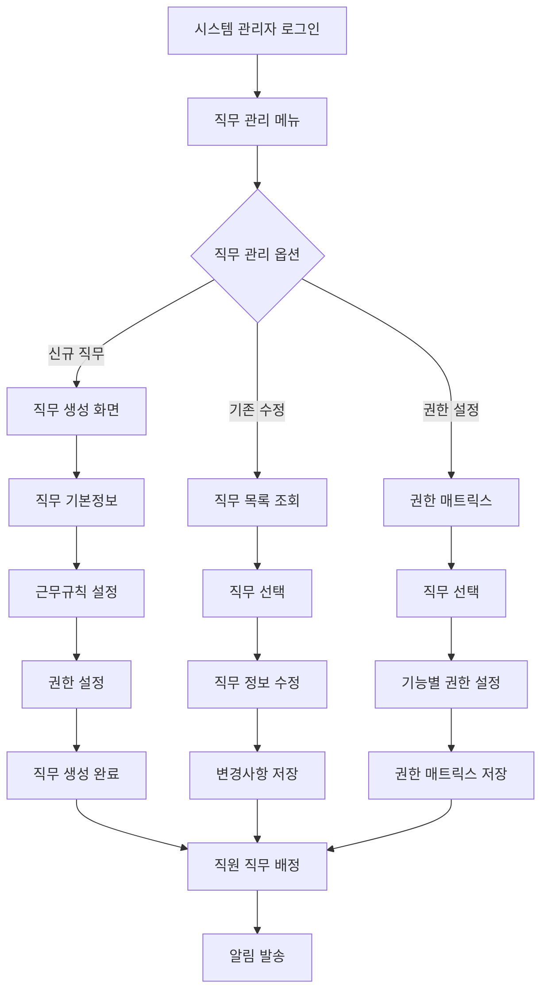

# ClockBox - PRD 세부 문서 : 직무

## 1. 개요 (Overview)
ClockBox 내 직무(Job) 관리 기능을 정의한다.  
직무별로 근무 규칙, 권한, 역할을 구분하여 관리한다.

### 목적
- 직무 단위로 근로 규칙 정의
- 부서/지점과 연계한 직무 관리
- 리포트/정산과 연결된 직무별 통계

---

## 2. UI Flow 다이어그램



### 화면 구성 예시

**직무 생성 화면**
```
┌─────────────────────────────────────┐
│ 직무 생성                           │
├─────────────────────────────────────┤
│ 직무명: [                 ]         │
│ 직무 카테고리: ○관리직 ○기술직      │
│                ○영업직 ○사무직      │
│ 직급: ○사원 ○대리 ○과장 ○부장    │
│ 설명: [                           ] │
│                                    │
│ 근무규칙:                           │
│ 주간 근무시간: [40] 시간            │
│ 유연근무: □허용                    │
│ 초과근무: □가능                    │
│                                    │
│ [생성] [취소]                      │
└─────────────────────────────────────┘
```

## 3. 사용자 시나리오 (User Flow)

### 시나리오 A: 기본 직무 체계 설정
1. **시스템 관리자 로그인**: 관리자 권한으로 시스템 접속
2. **직무 관리 접근**: 회사 설정 > 직무 관리 메뉴 선택
3. **직무 카테고리 생성**: 관리직, 기술직, 영업직, 사무직 대분류 설정
4. **세부 직무 생성**: 각 카테고리 내 구체적 직무 생성
5. **근무 규칙 설정**: 직무별 근무시간, 휴게시간 등 규칙 설정
6. **직무 권한 설정**: 직무별 시스템 접근 권한 설정
7. **직무 체계 확인**: 생성된 직무 체계 및 권한 구조 최종 확인

### 시나리오 B: 직원 직무 배정 및 관리
1. **직원 목록 조회**: 직무를 배정할 직원 목록 확인
2. **직원 선택**: 직무를 배정할 직원 선택
3. **직무 배정**: 선택된 직원에게 적절한 직무 배정
4. **근무 조건 설정**: 배정된 직무에 맞는 근무 조건 자동 설정
5. **권한 부여**: 직무에 따른 시스템 접근 권한 자동 부여
6. **배정 완료 알림**: 직무 배정 완료 후 해당 직원에게 알림 발송

### 시나리오 C: 직무 변경 및 승진 처리
1. **직무 변경 신청**: 직원 또는 관리자가 직무 변경 신청
2. **변경 사유 확인**: 승진, 전보, 강등 등 변경 사유 및 상세 내용 확인
3. **승인 프로세스**: 직무 변경 내용에 따른 승인 체계 진행
4. **새 직무 설정**: 승인된 변경사항에 따른 새로운 직무 배정
5. **권한 조정**: 변경된 직무에 맞는 시스템 권한 재설정
6. **이력 관리**: 직무 변경 이력 자동 기록 및 관리
7. **알림 및 공지**: 직무 변경 내용 관련 부서 및 직원들에게 공지

---

## 4. 기능 정의 (Feature Definition)

### 기본 직무 관리 기능
- **[FR-ROLE-001] 직무 생성 및 관리**
  - 직무명, 설명, 카테고리 등 기본 정보 관리
  - 직무 체계 트리 구조 생성 (부장 > 과장 > 대리 > 사원)
  - 직무별 상태 관리 (활성/비활성)
  - 직무 변경 이력 추적
  
- **[FR-ROLE-002] 근무 규칙 관리**
  - 직무별 주간 표준 근무시간 설정
  - 유연근무제 적용 여부 설정
  - 초과근무 가능 여부 설정
  - 근무 패턴 템플릿 제공 (정규, 교대, 재택 등)

### 직무별 권한 관리
- **[FR-ROLE-003] 권한 매트릭스**
  - 직무와 기능별 권한 매트릭스 관리
  - 읽기, 쓰기, 수정, 삭제 등 세분화된 권한 설정
  - 기능별 접근 권한 일괄 설정
  - 권한 템플릿 저장 및 재사용
  
- **[FR-ROLE-004] 직무 상속 및 위임**
  - 상위 직무의 권한 자돐 상속 설정
  - 임시 권한 부여 및 자동 만료 기능
  - 권한 위임 체인 추적
  - 권한 변경 승인 프로세스

### 직무 배정 및 이력 관리
- **[FR-ROLE-005] 직원 직무 배정**
  - 직원별 주 직무 배정 및 관리
  - 다중 직무 보유 기능 (겸직 등)
  - 직무 배정비율 관리 (70%, 30% 등)
  - 직무별 소속 직원 현황 조회
  
- **[FR-ROLE-006] 직무 변경 관리**
  - 승진, 전보, 강등 등 직무 변경 처리
  - 직무 변경 승인 워크플로우
  - 변경 이력 자동 기록 및 추적
  - 변경 시 권한 자동 업데이트

### 시스템 연동 기능
- **[FR-ROLE-007] 근무일정 연동**
  - 직무별 근무시간 정책 자동 적용
  - 직무 체계에 맞는 스케줄 생성
  - 교대근무 대상 직무 설정
  - 직무 변경시 일정 자동 업데이트
  
- **[FR-ROLE-008] 리포팅 연동**
  - 직무별 근태 현황 리포트
  - 직무별 인건비 및 비용 분석
  - 직무 변경 현황 통계
  - 관리자용 대시보드 제공

---

## 4. UI/UX 요구사항
### 직무 관리 대시보드
- **인터랙티브 직무 조직도**:
  - 계층 구조 시각화 (트리뷰, 매트릭스뷰)
  - 드래그 앤 드롭으로 직무 구조 재편성
  - 직무별 인원 현황 및 공석률 표시
  - 권한 흐름도 오버레이 표시
- **고급 검색 및 필터**:
  - 다중 조건 검색 (직무명, 카테고리, 스킬, 경험)
  - 기본 필터 (직무 유형, 경력 수준, 급여 범위)
  - 저장된 검색 조건 및 즐겨찾기
  - 실시간 검색 결과 업데이트

### 권한 관리 인터페이스
- **권한 매트릭스 시각화**:
  - 직무×기능 2차원 테이블로 권한 표시
  - 색상 코딩으로 권한 레벨 구분
  - 일괄 권한 설정 도구
  - 권한 변경 이력 시각화
- **권한 시뮬레이터**:
  - 권한 변경 전 영향도 미리보기
  - 충돌하는 권한 자동 감지
  - 권한 최적화 제안
  - 롤백 시나리오 테스트

### 직무 프로필 및 매칭 시스템
- **직무 상세 프로필**:
  - 직무 설명서 (책임, 권한, 요구사항)
  - 필요 스킬 및 자격 요건 시각화
  - 성과 지표 및 평가 기준 표시
  - 경력 발전 경로 로드맵
- **스킬 갭 분석 대시보드**:
  - 현재 스킬 vs 요구 스킬 레이더 차트
  - 부족한 역량별 교육 과정 추천
  - 동료 직원과의 스킬 비교
  - 목표 달성을 위한 액션 플랜

### 모바일 및 접근성
- **모바일 최적화**:
  - 터치 친화적 직무 브라우징
  - 음성 검색으로 직무 정보 조회
  - 푸시 알림으로 직무 관련 업데이트
  - 오프라인 모드 지원 (기본 정보)
- **접근성 준수**:
  - 스크린 리더 호환
  - 키보드 네비게이션 완벽 지원
  - 고대비 모드 및 글씨 크기 조절
  - 다국어 지원 (한국어, 영어, 기타)

---

## 5. 비즈니스 규칙
### 직무 계층 및 구조 규칙
- **직무 계층 제약**:
  - 직무 계층 깊이는 최대 8레벨까지 허용
  - 순환 참조 방지 (하위 직무가 상위 직무의 상급자가 될 수 없음)
  - 동일 레벨 내에서는 횡적 이동 가능
- **직무 카테고리 관리**:
  - 회사당 최대 20개 주요 직무 카테고리
  - 카테고리 삭제 시 하위 직무 자동 재분류
  - 업계 표준 직무 분류 체계 준용 권장

### 직무 배정 및 변경 규칙
- **다중 직무 배정**:
  - 하나의 직원은 최대 3개 직무 동시 보유 가능
  - 주 직무 1개 필수 지정 (급여, 평가 기준)
  - 부 직무는 시간 비율 제한 (주 직무 70% 이상)
- **직무 변경 승인 체계**:
  - 동급 내 이동: 직속 상관 승인
  - 승진: 2단계 상위 관리자 승인
  - 타 부서 이동: 양쪽 부서장 승인
  - 임시 직무: 30일 이내 자동 해제

### 권한 및 보안 규칙
- **권한 상속 원칙**:
  - 하위 직무는 상위 직무 권한 자동 상속
  - 명시적 거부 권한은 상속 권한보다 우선
  - 임시 권한은 영구 권한보다 우선 적용
- **권한 분리 원칙**:
  - 중요 업무는 최소 2인 승인 필요
  - 재무/인사 권한은 별도 승인 체계
  - 시스템 관리 권한은 IT 관리자만 부여

### 컴플라이언스 및 감사 규칙
- **법적 요구사항**:
  - 근로기준법상 관리감독자 지위 명시
  - 직무별 최대 근로시간 준수
  - 직무 변경 시 근로조건 변경 동의 필요
- **데이터 보존 규칙**:
  - 직무 변경 이력 퇴사 후 5년 보관
  - 권한 변경 로그 실시간 기록
  - 민감 정보 접근 시 추가 인증 필요
- **감사 및 검토**:
  - 분기별 권한 정합성 자동 검사
  - 연 1회 직무 체계 전면 검토
  - 부적절한 권한 자동 경고 시스템

---

## 6. 데이터 모델링 (초안)
### roles 테이블
| 컬럼명 | 타입 | 설명 |
|--------|------|------|
| id | PK | 직무 ID |
| company_id | FK(companies.id) | 회사 ID |
| name | string | 직무명 |
| description | string | 설명 |
| work_rule_id | FK(work_rules.id) | 근로 규칙 |
| status | enum(active, inactive) | 상태 |

### work_rules 테이블
| 컬럼명 | 타입 | 설명 |
|--------|------|------|
| id | PK | 규칙 ID |
| type | enum(standard, flexible, shift) | 규칙 유형 |
| max_hours | int | 최대 근로시간 |
| min_hours | int | 최소 근로시간 |
| break_policy | string | 휴게시간 규칙 |

---

## 7. 알림 및 연동
- 직무 변경 시 배정 직원에게 알림
- 직무 삭제 시 관리자 경고 알림

---

## 8. 예외 및 에러 처리
| 케이스 | 조건 | 시스템 동작 | 사용자 메시지 |
|--------|------|------------|--------------|
| 중복 직무명 | 동일 회사 내 중복 | 생성 차단 | “이미 존재하는 직무명입니다.” |
| 미배정 직원 | 직무 삭제 후 미배정 발생 | 경고 표시 | “일부 직원이 미배정 상태로 변경됩니다.” |
| 잘못된 규칙 | 근로 규칙 불일치 | 저장 차단 | “올바른 근로 규칙을 선택해주세요.” |

---

## 9. 연관성 (Dependency & Integration)
- **직원 (prd_employee.md)**: 직원 직무 배정
- **근무일정 (prd_schedule.md)**: 직무별 근무 규칙 반영
- **리포트 (prd_report.md)**: 직무별 근로시간/휴가 통계

---

## 10. 성공 지표 (KPI)
### 직무 관리 효율성 지표
- **직무 체계 구축**:
  - 직무 생성 후 직원 배정 완료율 ≥ 95%
  - 직무 구조 설계 완료 시간 ≤ 2시간 (100명 기준)
  - 직무 템플릿 활용률 ≥ 80%
  - 직무 중복/누락 자동 감지 정확도 ≥ 95%
- **권한 관리 효율성**:
  - 권한 설정 오류율 ≤ 1%
  - 권한 변경 반영 시간 ≤ 5분
  - 불필요한 권한 자동 식별률 ≥ 90%
  - 권한 감사 완료 시간 50% 단축

### 사용자 경험 지표
- **직무 매칭 정확성**:
  - 직무 매칭 만족도 ≥ 4.0/5.0
  - 스킬-직무 매칭 정확도 ≥ 85%
  - 경력 개발 경로 활용률 ≥ 70%
  - 직무 변경 신청 승인률 ≥ 90%
- **시스템 사용성**:
  - 직무 관리 대시보드 만족도 ≥ 4.5/5.0
  - 모바일 직무 검색 성공률 ≥ 95%
  - 직무 정보 검색 응답시간 ≤ 2초
  - 사용자 온보딩 완료율 ≥ 90%

### 비즈니스 임팩트 지표
- **조직 효율성 개선**:
  - 직무 기반 의사결정 속도 30% 향상
  - 부서 간 협업 효율성 25% 개선
  - 직무 관련 문의 50% 감소
  - 관리자 업무 부담 40% 경감
- **인재 관리 최적화**:
  - 내부 승진률 20% 향상
  - 직무 만족도 15% 개선
  - 핵심 인재 이탈률 30% 감소
  - 신규 직무 적응 기간 50% 단축

### 컴플라이언스 및 보안 지표
- **보안 및 규정 준수**:
  - 권한 오남용 사고 0건
  - 개인정보 접근 권한 정합성 100%
  - 법적 감사 대응 시간 ≤ 24시간
  - 데이터 백업 성공률 ≥ 99.9%
- **시스템 안정성**:
  - 직무 시스템 가용성 ≥ 99.5%
  - 대량 권한 변경 처리 시간 ≤ 10분
  - API 응답 시간 ≤ 300ms
  - 동시 접속자 2000명 지원

### 장기 전략 지표
- **조직 발전 기여도**:
  - 직무 기반 조직 개편 성공률 ≥ 85%
  - 새로운 비즈니스 모델 대응 속도 향상
  - 디지털 전환 가속화 기여도 측정
  - 경쟁우위 확보를 위한 핵심 역량 강화

## 10-1. 고급 분석 및 리포팅
### 예측 분석 기능
- **직무 수요 예측**: 사업 계획 기반 향후 3년 직무 필요량 예측
- **이탈 리스크 분석**: 직무 만족도 및 성과 데이터 기반 이탈 위험 직원 식별
- **스킬 갭 예측**: 기술 트렌드 분석으로 미래 필요 역량 예측
- **조직 최적화**: 시뮬레이션 기반 최적 직무 구조 제안

### 벤치마킹 및 경쟁 분석
- **업계 표준 비교**: 동종 업계 직무 체계와 비교 분석
- **급여 수준 분석**: 직무별 시장 급여와 내부 급여 비교
- **역량 수준 평가**: 업계 평균 대비 직무별 역량 수준 평가
- **베스트 프랙티스**: 우수 기업의 직무 관리 사례 학습
