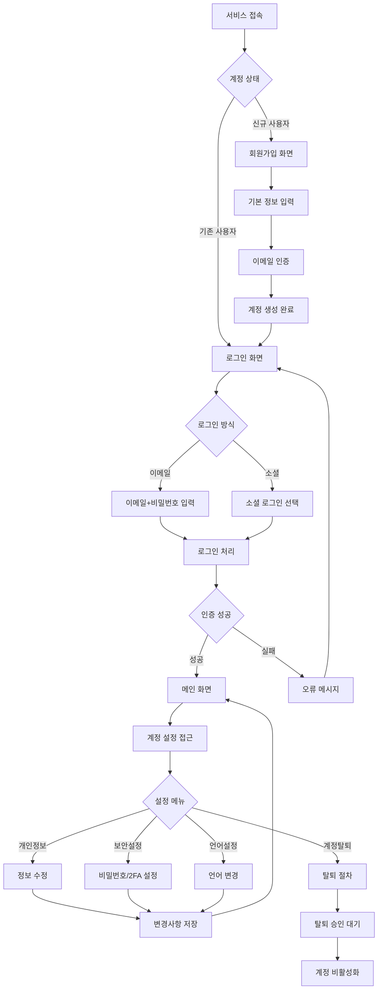

# ClockBox - PRD 세부 문서 : 계정

## 1. 개요 (Overview)
ClockBox 사용자의 개인 계정 및 로그인 관련 기능을 정의한다.  
사용자 인증, 개인정보 관리, 다국어 설정, 계정 보안 정책을 포함한다.

### 목적
- 안전한 사용자 인증 및 개인정보 보호  
- 글로벌 환경 대응을 위한 다국어 지원  
- 계정 라이프사이클(생성 → 수정 → 비활성화/삭제) 전 과정 관리  

---

## 2. UI Flow 다이어그램



### 화면 구성 예시

**로그인 화면**
```
┌─────────────────────────────────────────────────────────────────┐
│                        ClockBox                                 │
│                     근태관리 서비스                              │
├─────────────────────────────────────────────────────────────────┤
│                                                                 │
│  ┌─ 로그인 ─────────────────────────────────────────────────────┐ │
│  │                                                             │ │
│  │  이메일: [                                        ]         │ │
│  │  비밀번호: [                                      ]         │ │
│  │                                     ☑ 로그인 상태 유지     │ │
│  │                                                             │ │
│  │                      [로그인]                               │ │
│  │                                                             │ │
│  │  ───────────────── 또는 ─────────────────                   │ │
│  │                                                             │ │
│  │        [Google로 로그인]  [Apple로 로그인]                   │ │
│  │                                                             │ │
│  └─────────────────────────────────────────────────────────────┘ │
│                                                                 │
│                    처음이세요? [회원가입]                        │
│                   비밀번호를 잊으셨나요? [찾기]                  │
└─────────────────────────────────────────────────────────────────┘
```

---

## 3. 사용자 시나리오 (User Flow)
### 시나리오 A: 신규 가입
1. 사용자가 이메일로 회원가입 신청  
2. 비밀번호 설정 및 약관 동의  
3. 이메일 인증 완료 후 로그인 가능  

### 시나리오 B: 계정 정보 수정
1. 사용자가 로그인 후 프로필 > 계정 설정 진입  
2. 이메일/비밀번호/언어 변경 가능  
3. 변경 시 재인증 필요  

### 시나리오 C: 계정 탈퇴
1. 직원이 탈퇴 요청 → 관리자에게 알림  
2. 관리자는 승인 후 계정 ‘inactive’ 처리 (데이터는 유지)  

---

## 3. 기능 정의 (Feature Definition)
- **[FR-ACC-001] 회원가입**  
  - 이메일, 비밀번호, 휴대폰 번호 등록  
  - 소셜 로그인(Google, Apple) 지원  
  - 이메일 인증 필수  

- **[FR-ACC-002] 로그인/로그아웃**  
  - 이메일+비밀번호 / 소셜 로그인 가능  
  - JWT 기반 세션 관리  

- **[FR-ACC-003] 계정 정보 수정**  
  - 이메일, 비밀번호, 언어 변경 가능  
  - 변경 시 2FA(선택) 적용 가능  

- **[FR-ACC-004] 계정 탈퇴**  
  - 직원: 탈퇴 요청 → 관리자 승인 → inactive 처리  
  - 관리자: 회사 관리자가 탈퇴 시 다른 관리자 위임 필수  

- **[FR-ACC-005] 다국어 지원**  
  - 기본: 한국어, 영어  
  - 확장: 일본어, 스페인어 등 글로벌 대응  

---

## 4. UI/UX 요구사항
- **로그인 화면**: 이메일/비밀번호 입력, 소셜 로그인 버튼  
- **계정 설정 화면**: 이메일/비밀번호/언어 변경 탭  
- **탈퇴 플로우**: 탈퇴 사유 입력 → 확인 팝업 → 관리자 승인 후 반영  

---

## 5. 비즈니스 규칙
- 이메일 중복 가입 불가  
- 비밀번호 정책: 최소 8자, 특수문자/숫자 포함  
- 탈퇴 요청 후 30일간 데이터 보관, 이후 영구 삭제 가능  
- 소셜 로그인은 이메일과 매핑 필요  

---

## 6. 데이터 모델링 (초안)

### users 테이블 (시작하기 PRD와 연계)
| 컬럼명 | 타입 | 설명 |
|--------|------|------|
| id | PK | 사용자 ID |
| email | string | 로그인 이메일 |
| phone | string | 휴대폰 번호 |
| password_hash | string | 비밀번호 해시 |
| language | string | 언어 설정 |
| role | enum(admin, employee, both) | 역할 |
| status | enum(active, inactive, pending_delete) | 계정 상태 |
| created_at | datetime | 가입일 |
| deleted_at | datetime | 삭제일 |

### account_logs 테이블
| 컬럼명 | 타입 | 설명 |
|--------|------|------|
| id | PK | 로그 ID |
| user_id | FK(users.id) | 사용자 ID |
| action | enum(login, logout, password_change, email_change, delete_request) | 활동 유형 |
| timestamp | datetime | 발생 시간 |
| ip_address | string | 접속 IP |

---

## 7. 알림 및 연동
- 회원가입 시 이메일 인증 메일 발송  
- 계정 탈퇴 요청 시 관리자 푸시 알림  
- 비밀번호 변경 시 보안 알림 메일 발송  
- 외부 인증 시스템(SSO) 연동 가능  

---

## 8. 예외 및 에러 처리
| 케이스 | 조건 | 시스템 동작 | 사용자 메시지 |
|--------|------|------------|--------------|
| 이메일 중복 | 동일 이메일 존재 | 가입 차단 | “이미 등록된 이메일입니다.” |
| 비밀번호 규칙 위반 | 8자 미만/특수문자 미포함 | 변경 불가 | “비밀번호는 영문+숫자+특수문자를 포함해야 합니다.” |
| 인증 실패 | 잘못된 비밀번호 | 로그인 차단 | “이메일 또는 비밀번호가 올바르지 않습니다.” |
| 이메일 미인증 로그인 | 인증 미완료 | 로그인 차단 | “이메일 인증 후 로그인 가능합니다.” |
| 탈퇴 요청 중 로그인 | pending_delete 상태 | 로그인 차단 | “계정 탈퇴가 진행 중입니다.” |
| 관리자 탈퇴 시 다른 관리자 없음 | 회사 관리자 1명 | 탈퇴 차단 | “다른 관리자를 지정해야 탈퇴할 수 있습니다.” |

---

## 9. 연관성 (Dependency & Integration)
- **시작하기 (prd_start.md)**: 회원가입 및 합류 플로우 공유  
- **직원 (prd_employee.md)**: 계정 정보가 직원 정보와 연결  
- **회사설정 (prd_company.md)**: 다국어 및 권한 관리 설정 연동  
- **보안/로그 (공통)**: 계정 보안 정책, 감사 로그 관리  

---

## 10. 성공 지표 (KPI)
- 회원가입 → 이메일 인증 완료율 **≥ 90%**  
- 로그인 성공률 **≥ 99%**  
- 비밀번호 재설정 성공률 **≥ 95%**  
- 계정 탈퇴 프로세스 완료율 **100%**  
