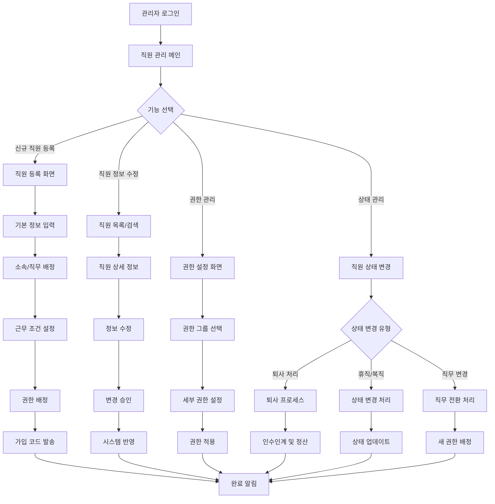

# ClockBox - PRD 세부 문서 : 직원 관리 ✅ 구현 완료

## 1. 개요 (Overview)
ClockBox의 직원(Employee) 관리 시스템이 완전히 구현되었습니다.
4-tier RBAC 시스템과 통합되어 직원의 등록, 권한 관리, 근로 규칙 배정, 계정 상태 관리가 모두 운영 가능합니다.

### 구현 완료된 목적 ✅
- **전체 직원 CRUD 관리**: `/system/users`에서 완전한 사용자 관리
- **역할 기반 권한 시스템**: 4-tier RBAC와 완전 통합
- **회사-조직 계층 관리**: 계층적 구조 지원
- **실시간 데이터 동기화**: 사용자 정보 즉시 반영

## 1-1. 사용자 관리 시스템 구현 상태 ✅

### 완전히 구현된 사용자 관리 기능
| 기능 | 구현 상태 | 위치 | 설명 |
|------|----------|------|------|
| 사용자 목록 조회 | ✅ 100% | `/system/users` | 전체 직원 목록, 검색, 필터링 |
| 사용자 상세 정보 | ✅ 100% | 모달/상세 페이지 | 완전한 프로필 정보 표시 |
| 사용자 생성 | ✅ 100% | 생성 모달 | 모든 필드 입력, 역할 배정 |
| 사용자 편집 | ✅ 100% | 편집 모달 | 전체 필드 수정 가능 |
| 역할 관리 | ✅ 100% | 드롭다운 선택 | 4-tier 역할 즉시 변경 |
| 조직 배정 | ✅ 100% | 계층적 드롭다운 | 회사-조직 연동 선택 |
| 상태 관리 | ✅ 100% | 활성/비활성 토글 | 계정 활성화 상태 제어 |
| 데이터 정리 | ✅ 100% | 정리 버튼 | 테스트 사용자 일괄 삭제 |

### 데이터베이스 스키마 ✅
```sql
-- employees 테이블 (완전 구현됨)
CREATE TABLE employees (
  id UUID PRIMARY KEY DEFAULT gen_random_uuid(),
  profile_id UUID REFERENCES auth.users(id),
  email TEXT UNIQUE NOT NULL,
  full_name TEXT NOT NULL,
  phone_number TEXT,
  user_role user_role_enum NOT NULL DEFAULT 'employee',
  company_id UUID REFERENCES companies(id),
  organization_id UUID REFERENCES organizations(id),
  manager_id UUID REFERENCES employees(id),
  status employee_status_enum DEFAULT 'active',
  created_at TIMESTAMP DEFAULT now(),
  updated_at TIMESTAMP DEFAULT now()
);

-- Row Level Security 정책 (완전 구현됨)
-- 역할별 데이터 접근 제어
```

### API 엔드포인트 ✅
- **`get_all_users_for_admin()`**: 전체 사용자 조회 (조직 정보 포함)
- **`get_user_details_for_admin(user_id)`**: 사용자 상세 정보 조회  
- **`update_user_for_admin(user_id, updates)`**: 사용자 정보 수정
- **`cleanup_mock_users_for_admin()`**: 테스트 사용자 정리
- **`/api/system-admin/*`**: REST API 엔드포인트

### UI 구현 세부사항 ✅
- **검색 및 필터**: 이름, 이메일, 역할별 실시간 검색
- **정렬 기능**: 이름, 이메일, 역할, 생성일 기준 정렬
- **페이지네이션**: 대량 데이터 효율적 처리
- **반응형 디자인**: 모바일/데스크톱 최적화
- **실시간 업데이트**: 수정 시 즉시 UI 반영

---

## 2. UI Flow 다이어그램



### 화면 구성 예시

**직원 등록 화면**
```
┌─────────────────────────────────────────────────────────────────┐
│ 신규 직원 등록                                                 │
├─────────────────────────────────────────────────────────────────┤
│ 기본 정보                                                     │
│ 성명: [                    ] 이메일: [                    ]    │
│ 전화번호: [                ] 입사일: [2024-03-15] [달력]      │
│                                                                 │
│ 소속 정보                                                     │
│ 회사: [ABC 회사] ▼          지점: [본사] ▼                    │
│ 부서: [개발팀] ▼            직무: [백엔드 개발자] ▼           │
│ 직급: [사원] ▼              직속상사: [김팀장] ▼              │
│                                                                 │
│ 근무 조건                                                     │
│ 고용형태: ○정규직 ○계약직 ○파트타임                        │
│ 근무시간: [09:00] ~ [18:00]  휴식시간: [12:00] ~ [13:00]    │
│ 기본급: [₩3,000,000]        │
│                                                                 │
│ 권한 설정                                                     │
│ 권한 그룹: [일반 직원] ▼    ☑ 출퇴근 관리                   │
│                            ☑ 휴가 신청                       │
│                            ☐ 관리자 기능                     │
│                                                                 │
│               [미리보기] [등록 완료] [취소]                     │
└─────────────────────────────────────────────────────────────────┘
```

---

## 3. 사용자 시나리오 (User Flow)
### 시나리오 A: 신규 직원 등록 및 온보딩
1. **직원 기본 정보 등록**: 관리자가 이름, 이메일, 전화번호, 입사일 입력
2. **소속 및 직무 배정**: 부서/지점 배정, 직무 선택
3. **근무 조건 설정**: 근무시간, 급여, 근무 형태 (정규직/계약직/파트타임)
4. **권한 배정**: 직무에 따른 기본 권한 부여
5. **합류코드 발송**: 직원에게 가입 코드 메일/SMS 전송
6. **첫 로그인**: 직원이 코드로 가입 후 첫 로그인 및 비밀번호 설정
7. **기본 설정 안내**: 옵션 설정 및 주요 기능 안내

### 시나리오 B: 직원 정보 수정 및 관리
1. **기본 정보 수정**: 연락처, 주소, 기타 개인정보 수정
2. **소속 변경**: 부서/지점 이동, 직무 변경 처리
3. **근무 조건 변경**: 근무시간, 급여, 근무형태 수정
4. **권한 수정**: 직무 변경 시 권한 자동 조정
5. **변경 이력**: 모든 정보 변경 사항 기록 및 추적
6. **승인 처리**: 중요 변경 사항 승인 처리
7. **연동 시스템 업데이트**: HR, 급여 시스템 자동 반영

### 시나리오 C: 직원 상태 관리 및 퇴사 처리
1. **직원 상태 변경**: 정규직 전환, 휴직, 복직 등 상태 관리
2. **퇴사 신청**: 직원 퇴사 신청 및 승인 프로세스
3. **퇴사 처리**: 채무 정산, 인수인계, 장비 반납
4. **계정 비활성화**: 퇴사 직원 시스템 접근 권한 제한
5. **데이터 보존**: 법정 기간 데이터 보관 및 보안 처리
6. **최종 정리**: 퇴사자 데이터 아카이빙 및 사후 관리

### 시나리오 D: 직원 권한 및 조직 관리
1. **권한 그룹 생성**: 관리자가 직무별/부서별 권한 그룹 생성 및 관리
2. **권한 배정**: 직원별 또는 그룹별로 시스템 접근 권한 설정
3. **조직도 관리**: 부서 구조 및 보고 체계 설정 및 관리
4. **권한 변경 승인**: 권한 변경 요청에 대한 승인 프로세스
5. **권한 이력 관리**: 모든 권한 변경 사항 기록 및 추적
6. **정기 권한 검토**: 분기별 권한 적정성 검토 및 조정

---

## 3. 기능 정의 (Feature Definition)
### 기본 직원 관리
- **[FR-EMP-001] 직원 등록 및 기본 정보 관리**
  - 신규 직원 기본 정보 등록 (이름, 전화, 이메일, 주소)
  - 소속 부서/지점 및 직무 배정
  - 근무 조건 설정 (근무시간, 급여, 근무형태)
  - 직원 사진 및 기타 부가 정보 관리
- **[FR-EMP-002] 직원 상태 및 권한 관리**
  - 직원 상태 관리 (active, inactive, terminated)
  - 직무별 기본 권한 부여 및 조정
  - 근로 규칙 설정 (소정근무시간, 최대근무시간)
  - 특별 권한 및 예외 사항 관리
- **[FR-EMP-003] 기본 온보딩 시스템**
  - 전사 온보딩 체크리스트 제공
  - 멘토 및 버디 수동 매칭 기능
  - 진행 상황 대시보드 및 체크 배지
  - 기본 언어 설정 및 내용 관리

### 고급 직원 운영
- **[FR-EMP-004] 동적 권한 및 역할 관리**
  - 직무 기반 자동 권한 할당 및 승계
  - 임시 권한 부여 및 자동 만료 시스템
  - 교차 검증을 통한 권한 오남용 방지
  - 프로젝트 기반 임시 팀 구성 및 권한 관리
- **[FR-EMP-005] 적응형 근로 규칙 엔진**
  - 직원 특성 기반 맞춤형 근무 규칙 자동 배정
  - 유연 근무제 지원 (재택, 탄력, 시차 출퇴근)
  - 규칙 변경 시 영향도 분석 및 점진적 적용
  - 개인별 근무 패턴 학습 및 최적화 제안
- **[FR-EMP-006] 통합 디바이스 및 보안 관리**
  - 다중 디바이스 등록 및 원격 관리
  - 생체 인증 및 2FA 통합 보안
  - 디바이스 분실/도난 시 원격 잠금 및 데이터 삭제
  - BYOD 정책 지원 및 컨테이너화

### 기본 분석 및 보고
- **[FR-EMP-007] 직원 기본 분석**
  - 성과 평가 리포트 및 통계
  - 기본 스킬 및 경력 지표 관리
  - 부서별 협업 현황 보고
  - 직원 만족도 설문 및 결과 분석
- **[FR-EMP-008] 고급 검색 및 탐색 시스템**
  - 자연어 기반 직원 검색
  - 다차원 필터링 (스킬, 경험, 성과, 가용성)
  - 유사 직원 추천 및 대체 인력 제안
  - 실시간 검색 결과 및 알림 설정
- **[FR-EMP-009] 예측 인력 계획**
  - 사업 계획 기반 인력 수요 예측
  - 승계 계획 및 핵심 인재 백업 관리
  - 조직 변경 시나리오 시뮬레이션
  - ROI 기반 인재 투자 우선순위 결정

### 직원 발전 및 참여
- **[FR-EMP-010] 개인화된 경력 개발**
  - 기본 경력 개발 계획 수립
  - 목표 설정 및 진도 추적 시스템
  - 멘토링 프로그램 매칭 및 관리
  - 내부 모빌리티 기회 자동 알림
- **[FR-EMP-011] 직원 참여 및 웰빙**
  - 실시간 만족도 모니터링 (펄스 서베이)
  - 스트레스 레벨 및 번아웃 조기 감지
  - 팀 빌딩 및 소셜 이벤트 관리
  - 익명 피드백 및 제안 시스템

---

## 4. UI/UX 요구사항
### 통합 직원 대시보드
- **다차원 직원 뷰**:
  - 카드뷰 (프로필 사진, 핵심 정보 요약)
  - 테이블뷰 (상세 정보 비교 가능)
  - 조직도뷰 (계층 구조 시각화)
  - 타임라인뷰 (직원 이력 시간순 표시)
- **고급 검색 인터페이스**:
  - 자연어 검색 ("영업팀의 3년 이상 경력자")
  - 다중 조건 필터 (부서, 직급, 경력)
  - 실시간 검색 결과 업데이트
  - 검색 기록 및 자주 찾는 직원

### 직원 프로필 및 상세 정보
- **360도 프로필 뷰**:
  - 개인 정보, 경력, 스킬, 성과 통합 표시
  - 인터랙티브 스킬 레이더 차트
  - 경력 발전 타임라인 시각화
  - 소셜 네트워크 관계도 (팀 내 협업 관계)
- **동적 정보 업데이트**:
  - 실시간 상태 표시 (온라인/오프라인, 근무중/휴식)
  - 최근 활동 피드 (출근, 프로젝트 참여 등)
  - 개인화된 알림 센터
  - 셀프 서비스 정보 수정

### 생명주기 관리 인터페이스
- **온보딩 진행 대시보드**:
  - 프로그레스 바로 온보딩 단계 시각화
  - 체크리스트 형태의 완료 항목
  - 멘토-멘티 연결 상태 표시
  - 적응도 점수 및 개선 제안
- **상태 전환 워크플로우**:
  - 시각적 워크플로우 다이어그램
  - 각 단계별 필요 승인자 표시
  - 진행 상황 실시간 추적
  - 승인 대기, 완료, 반려 상태 명확 표시

### 분석 및 리포팅 UI
- **직원 분석 대시보드**:
  - 성과 트렌드 그래프
  - 스킬 발전 히트맵
  - 팀워크 네트워크 시각화
  - 만족도 및 참여도 지표
- **예측 분석 시각화**:
  - 이탈 위험 경고등 시스템
  - 성과 예측 곡선
  - 스킬 갭 매트릭스
  - 경력 발전 시나리오 비교

### 모바일 및 접근성
- **모바일 최적화**:
  - 터치 친화적 직원 카드 인터페이스
  - 스와이프 기반 빠른 액션 (승인, 거절 등)
  - 음성 명령 지원 ("김철수 직원 정보 보여줘")
  - 오프라인 기본 정보 접근
- **접근성 및 다국어**:
  - 스크린 리더 완벽 지원
  - 키보드 단축키 네비게이션
  - 15개 언어 지원 (한국어, 영어, 일본어, 중국어 등)
  - 문화권별 UI/UX 차별화

---

## 5. 비즈니스 규칙
- 직원은 최소 1개 지점/직무에 배정되어야 함
- 비활성화 직원은 출퇴근 기록 불가
- 직원 삭제는 불가, 영구삭제는 1년 후 가능

---

## 6. 데이터 모델링 (초안)
### employees 테이블
| 컬럼명 | 타입 | 설명 |
|--------|------|------|
| id | PK | 직원 ID |
| user_id | FK(users.id) | 계정 ID |
| org_id | FK(orgs.id) | 소속 지점 |
| role_id | FK(roles.id) | 직무 |
| status | enum(active, inactive, terminated) | 상태 |
| join_date | datetime | 입사일 |
| leave_date | datetime | 퇴사일 |
| created_at | datetime | 등록일 |

---

## 7. 알림 및 연동
- 신규 등록 시 직원에게 합류 메일 발송
- 권한 변경 시 알림
- 퇴사 처리 시 관리자에게 리포트 발송

---

## 8. 예외 및 에러 처리
| 케이스 | 조건 | 시스템 동작 | 사용자 메시지 |
|--------|------|------------|--------------|
| 중복 이메일 | 동일 이메일 존재 | 등록 차단 | “이미 등록된 이메일입니다.” |
| 미배정 직원 | 지점/직무 미배정 | 저장 차단 | “직원은 반드시 지점/직무에 배정되어야 합니다.” |
| 퇴사 처리 후 로그인 | status=terminated | 로그인 차단 | “퇴사 처리된 계정입니다.” |

---

## 9. 연관성 (Dependency & Integration)
- **조직/지점 (prd_org.md)**: 직원은 반드시 지점에 속해야 함
- **직무 (prd_role.md)**: 직무에 따른 근로 규칙 반영
- **근무일정 (prd_schedule.md)**: 직원 배정 스케줄 생성
- **출퇴근기록 (prd_attendance.md)**: 직원별 출퇴근 데이터 기록

---

## 10. 성공 지표 (KPI)
### 온보딩 및 적응 지표
- **온보딩 효율성**:
  - 신규 직원 등록 후 합류 완료율 ≥ 95%
  - 온보딩 프로세스 완료 시간 ≤ 5일 (평균)
  - 온보딩 체크리스트 완료율 ≥ 98%
  - 신규 직원 첫 달 만족도 ≥ 4.2/5.0
- **초기 적응도**:
  - 첫 3개월 이탈률 ≤ 5%
  - 멘토링 프로그램 참여율 ≥ 85%
  - 신규 직원 생산성 달성 시간 ≤ 30일
  - 온보딩 완료 후 피드백 점수 ≥ 4.5/5.0

### 시스템 효율성 지표
- **데이터 관리 정확성**:
  - 직원 정보 업데이트 정확도 ≥ 99.5%
  - 프로필 데이터 동기화 지연 시간 ≤ 30초
  - 중복 직원 기록 발생률 ≤ 0.1%
  - 데이터 무결성 검사 통과율 100%
- **검색 및 접근성**:
  - 직원 검색 결과 정확도 ≥ 95%
  - 고급 필터링 사용률 ≥ 70%
  - 모바일 앱 직원 관리 기능 사용률 ≥ 60%
  - 평균 직원 정보 조회 시간 ≤ 3초

### 직원 참여 및 만족도 지표
- **참여도 측정**:
  - 직원 셀프 서비스 포털 활용률 ≥ 80%
  - 개인 정보 업데이트 주기 ≤ 30일
  - 피드백 시스템 참여율 ≥ 75%
  - 내부 커뮤니케이션 도구 활용률 ≥ 85%
- **만족도 및 웰빙**:
  - 직원 전반적 만족도 ≥ 4.0/5.0
  - 스트레스 레벨 모니터링 참여율 ≥ 60%
  - 번아웃 조기 감지 정확도 ≥ 80%
  - 웰빙 프로그램 참여율 ≥ 50%

### 비즈니스 임팩트 지표
- **인재 관리 최적화**:
  - 핵심 인재 이탈률 ≤ 10% (연간)
  - 내부 승진률 ≥ 70%
  - 스킬 갭 해소 시간 30% 단축
  - 인력 계획 정확도 ≥ 85%
- **조직 효율성 개선**:
  - HR 관리 업무 시간 40% 단축
  - 직원 문의 자동 해결률 ≥ 60%
  - 관리자 업무 부담 30% 경감
  - 컴플라이언스 준수율 100%

### 기본 분석 지표
- **데이터 품질**:
  - 직원 정보 완성도 ≥ 95%
  - 성과 평가 완료율 ≥ 90%
  - 기본 통계 생성 성공률 ≥ 95%
  - 경력 경로 추천 만족도 ≥ 4.0/5.0
- **시스템 성능**:
  - 직원 시스템 가용성 ≥ 99.5%
  - 대량 데이터 처리 시간 ≤ 5분 (1000명 기준)
  - API 응답 시간 ≤ 200ms
  - 동시 접속자 3000명 지원

### 보안 및 컴플라이언스 지표
- **보안 관리**:
  - 직원 정보 보안 사고 0건
  - 무권한 접근 차단율 100%
  - 데이터 암호화 적용률 100%
  - 정기 보안 감사 통과율 100%
- **법적 준수**:
  - 개인정보보호법 준수율 100%
  - 근로기준법 준수율 100%
  - 퇴사 처리 후 데이터 보존율 100%
  - 법정 의무 교육 이수율 100%

## 10-1. 고급 분석 및 벤치마킹
### 조직 건강도 지표
- **팀 다이나믹스**: 협업 효율성, 의사소통 품질, 갈등 해결 속도
- **문화 지표**: 혁신 지수, 학습 문화, 다양성 및 포용성 점수
- **리더십 효과성**: 관리자 역량 평가, 피드백 품질, 코칭 효과
- **변화 적응력**: 조직 변화 수용도, 디지털 전환 준비도

### 업계 벤치마킹
- **인재 지표 비교**: 동종 업계 대비 이탈률, 만족도, 생산성
- **급여 경쟁력**: 시장 급여 수준과의 비교 분석
- **복리후생 만족도**: 업계 평균 대비 복리후생 경쟁력
- **혁신 지표**: 직원 제안 건수, 혁신 프로젝트 참여율
