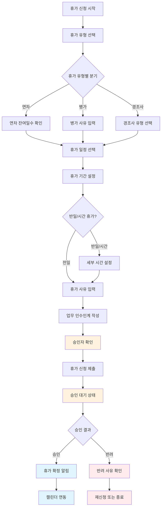

# ClockBox - PRD 세부 문서 : 휴가

## 1. 개요 (Overview)
ClockBox의 휴가(Leave) 관리 기능을 정의한다.  
연차, 경조사, 보상휴가, 규칙 기반 휴가 자동 발생 및 승인 워크플로우 포함.

### 목적
- 근로기준법 준수 (연차 15일 이상, 촉진제 등)
- 직원 휴가 사용 투명성 보장
- 급여/정산과 연계

---

## 2. UI Flow 다이어그램



### 휴가 신청 화면 구성도
```
┌──────────────────────────────────────┐
│  ClockBox - 휴가 신청               📅│
├──────────────────────────────────────┤
│                                    │
│  내 휴가 현황                        │
│  연차: 12일 / 15일 (3일 사용)        │
│  병가: 3일 사용                      │
│  보상휴가: 2일                       │
│                                    │
│  ┌──────────────────────────────────┐  │
│  │      새 휴가 신청                │  │
│  │                                │  │
│  │  휴가유형: [연차▼] [병가] [경조사] │  │
│  │  시작일: 2024-12-25 (수)         │  │
│  │  종료일: 2024-12-27 (금)         │  │
│  │  일수: 3일                       │  │
│  │                                │  │
│  │  신청사유:                       │  │
│  │  ┌────────────────────────────┐    │  │
│  │  │연말 가족여행                │    │  │
│  │  └────────────────────────────┘    │  │
│  │                                │  │
│  │  승인자: 김부장 (자동선택)        │  │
│  │                                │  │
│  │      [취소]       [신청하기]     │  │
│  └──────────────────────────────────┘  │
│                                    │
│  == 최근 휴가 이력 ==                │
│  12/15-16: 연차 2일 (승인완료)       │
│  11/20: 병가 1일 (승인완료)          │
│  11/05: 연차 1일 (승인완료)          │
│                                    │
└──────────────────────────────────────┘
```

---

## 3. 사용자 시나리오 (User Flow)
### 시나리오 A: 연차휴가 신청 및 승인

#### A-1: 연차휴가 신청 프로세스
1. **휴가 현황 확인**
   - 직원이 "휴가 신청" 메뉴 접근
   - 연차 잔여일수 및 사용 현황 확인
   - 올해 휴가 사용 패턴 및 만료 예정 휴가 알림

2. **휴가 일정 선택**
   - 달력에서 휴가 희망 날짜 선택
   - 연속 휴가 또는 단일 휴가 선택
   - 반일 휴가 (오전/오후) 또는 시간 휴가 옵션

3. **신청서 작성**
   - 휴가 사유 입력 (가족여행, 개인사정, 병원진료 등)
   - 업무 인수인계 계획 작성 (선택사항)
   - 긴급 연락 가능 여부 표시

4. **승인자 확인 및 제출**
   - 시스템이 직속상관을 자동 승인자로 설정
   - 최종 검토 후 신청 제출
   - 신청 완료 확인 메시지 및 승인 예상 시간 안내

#### A-2: 관리자 승인 프로세스
1. **승인 요청 알림**
   - 관리자에게 푸시알림 및 이메일 발송
   - 승인 대기 건수 대시보드에 표시
   - 승인 기한 알림 (48시간 이내 처리 권장)

2. **승인 검토**
   - 신청자 휴가 잔여 일수 확인
   - 팀 업무 일정과 충돌 여부 검토
   - 동일 기간 다른 팀원 휴가 현황 확인

3. **승인 결정**
   - 승인: 즉시 확정 처리 및 알림 발송
   - 조건부 승인: 대체 날짜 제안 또는 업무 조건 요청
   - 반려: 반려 사유 명시 및 재신청 안내

### 시나리오 B: 동적 보상휴가 및 웰빙 관리
1. **자동 보상휴가 발생**: 초과근무, 야간근무, 휴일근무 시 실시간 보상휴가 적립
2. **웰빙 기반 휴가 제안**: 스트레스 레벨, 연속 근무일 분석하여 휴식 필요 시점 예측
3. **유연한 사용 정책**: 반일, 시간 단위, 분할 사용 등 다양한 사용 패턴 지원
4. **만료 방지 알림**: 휴가 소멸 위험 시 사전 알림 및 사용 계획 제안
5. **팀 밸런싱**: 팀 내 휴가 사용 균형 모니터링 및 조정 제안
6. **성과 연동**: 목표 달성도와 연계된 추가 휴가 인센티브 제공

### 시나리오 C: 관리자 휴가 승인 처리
1. **휴가 승인 대기 목록 확인**: 관리자가 팀원들의 휴가 신청 목록 조회
2. **휴가 신청 내용 검토**: 각 휴가 신청의 기간, 사유, 업무 상황 확인
3. **팀 일정과 비교**: 해당 기간의 팀 업무 일정 및 회의 일정과 비교
4. **인력 충족도 확인**: 휴가 승인 시 필요한 업무 커버 가능 여부 판단
5. **승인 또는 반려 결정**: 검토 후 승인/반려 결정 및 사유 입력
6. **직원 알림**: 승인 결과를 해당 직원에게 자동 알림 발송

### 시나리오 D: 휴가 일정 조회 및 관리
1. **팀 휴가 현황 조회**: 관리자가 팀 전체의 휴가 일정을 캘린더 형태로 확인
2. **개인별 휴가 잔여일수**: 각 팀원의 연차/병가 사용 및 잔여 현황 확인
3. **휴가 중복 체크**: 동일 기간에 여러 명이 휴가를 신청했는지 확인
4. **월별 휴가 통계**: 부서별 월간 휴가 사용률 및 패턴 분석
5. **휴가 이력 관리**: 과거 휴가 사용 내역 및 패턴 조회
6. **연말 휴가 정리**: 연말 미사용 연차 정리 및 직원 안내

### 시나리오 E: 특별휴가 및 경조사 처리
1. **특별휴가 신청**: 결혼, 출산, 가족 상황 등 특별휴가 신청 접수
2. **경조사 휴가 처리**: 경조사 관련 휴가 신청 및 경조금 신청 연동
3. **서류 확인**: 특별휴가에 필요한 증빙 서류 (혼인신고서, 출생신고서 등) 확인
4. **휴가 일수 계산**: 사규에 따른 특별휴가 적용 일수 자동 계산
5. **급여 영향 확인**: 유급/무급 특별휴가에 따른 급여 계산 영향 확인
6. **HR 시스템 연동**: 승인 완료 시 인사 시스템 및 급여 시스템에 자동 반영

---
---

## 4. 기능 정의 (Feature Definition)
- **[FR-LEAVE-001] 휴가 신청**  
  - 연차, 병가, 특별휴가 신청
  - 휴가 기간 및 사유 입력
  - 첨부 서류 업로드
  
- **[FR-LEAVE-002] 휴가 승인 처리**  
  - 관리자 승인/반려
  - 승인 의견 입력
  - 직원 알림 발송
  
- **[FR-LEAVE-003] 휴가 현황 조회**  
  - 개인별 휴가 잔여일수
  - 사용 내역 및 일정
  - 팀 휴가 현황
  
- **[FR-LEAVE-004] 휴가 정책 관리**  
  - 휴가 유형 설정
  - 직급별 휴가 일수
  - 승인 라인 설정

---

## 5. UI/UX 요구사항
- 휴가 신청: 직관적인 달력 선택  
- 잔여 휴가: 명확한 일수 표시  
- 승인 현황: 실시간 상태 표시  

---

## 6. 비즈니스 규칙
- 연차: 입사 후 1년부터 15일 발생  
- 승인: 직속 상사 승인 필수  
- 취소: 승인 후 3일 전까지 취소 가능  
- 연차 소멸: 차년도 이월 불가  

---

## 7. 데이터 모델링 (초안)
### leaves 테이블
| 컬럼명 | 타입 | 설명 |
|--------|------|------|
| id | PK | 휴가 ID |
| employee_id | FK(employees.id) | 신청자 |
| type | enum(annual, sick, special) | 휴가 유형 |
| start_date | date | 시작일 |
| end_date | date | 종료일 |
| days | int | 휴가 일수 |
| reason | text | 신청 사유 |
| status | enum(pending, approved, rejected) | 상태 |
| approver_id | FK(employees.id) | 승인자 |
| created_at | datetime | 신청일 |

---

## 8. 알림 및 연동
- 휴가 신청시 관리자 알림  
- 승인/반려시 직원 알림  
- 급여 시스템 연동 (무급휴가 반영)  

---

## 9. 예외 및 에러 처리
| 케이스 | 조건 | 시스템 동작 | 사용자 메시지 |
|--------|------|------------|--------------|
| 잔여일수 부족 | 신청일 > 잔여일 | 신청 차단 | "잔여 휴가가 부족합니다." |
| 중복 신청 | 같은 기간 신청 | 차단 | "해당 기간에 이미 휴가가 있습니다." |
| 승인 지연 | 7일 미처리 | 알림 | "승인 대기 중인 휴가가 있습니다." |

---

## 10. 연관성 (Dependency & Integration)
- **직원 (prd_employee.md)**: 직원별 휴가 할당  
- **일정 (prd_schedule.md)**: 휴가 기간 일정 반영  
- **요청 (prd_request.md)**: 휴가 취소 요청 처리  
- **정산 (prd_payroll.md)**: 무급휴가 급여 차감  

---

## 11. 성공 지표 (KPI)
- 휴가 신청 처리 시간 ≤ 3일  
- 연차 사용률 ≥ 70%  
- 시스템 만족도 ≥ 4.0/5.0  