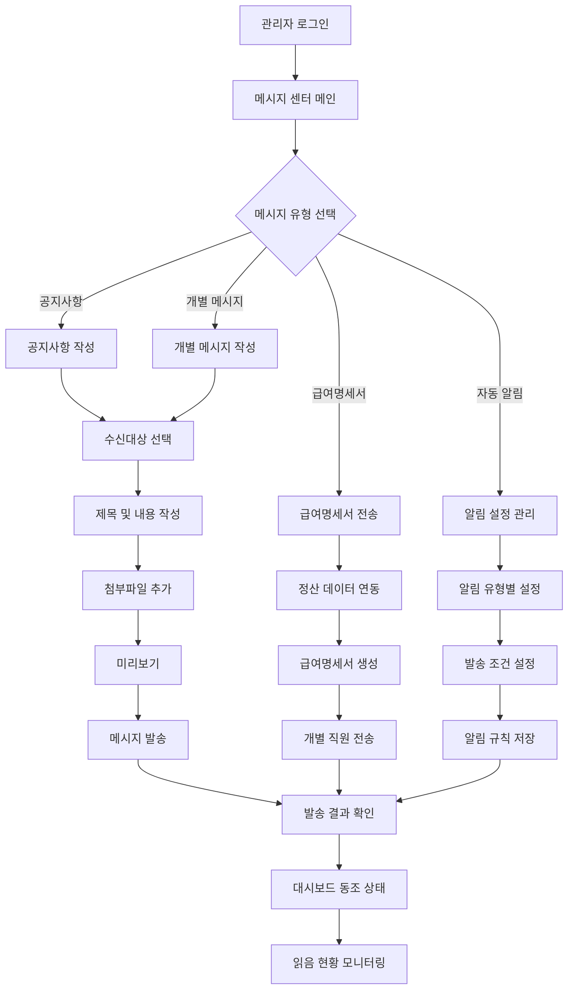

# ClockBox - PRD 세부 문서 : 메시지 (Message)

## 1. 개요 (Overview)
ClockBox의 메시지(Message) 기능은 관리자와 직원 간의 소통, 근태/요청/정산 관련 알림, 공지사항 발송을 위한 커뮤니케이션 채널을 제공한다.

### 목적
- 전사 소통의 효율화
- 근태/정산/요청 관련 자동 알림
- 모든 커뮤니케이션 로그의 투명한 보관

---

## 2. UI Flow 다이어그램



### 화면 구성 예시

**메시지 작성 화면**
```
┌─────────────────────────────────────────────────────────────────┐
│ 공지사항 작성                                                  │
├─────────────────────────────────────────────────────────────────┤
│ 수신대상: ○전체 직원 ○선택 부서 ○개별 직원                    │
│                                                                 │
│ 제목: [                                              ]         │
│                                                                 │
│ 내용:                                                         │
│ ┌───────────────────────────────────────────────────────────────┐ │
│ │                                                                 │ │
│ │                                                                 │ │
│ │                                                                 │ │
│ │                                                                 │ │
│ └───────────────────────────────────────────────────────────────┘ │
│                                                                 │
│ 첨부파일: [파일 선택] ☑ 이미지/문서 첨부 가능                │
│                                                                 │
│ 발송 옵션:                                                   │
│ ☑ 즉시 발송  ☑ 예약 발송 [2024-03-15 14:30]              │
│ ☑ 이메일 동시 발송  ☑ 모바일 푸시 알림                   │
│                                                                 │
│                    [미리보기] [발송] [취소]                    │
└─────────────────────────────────────────────────────────────────┘
```

## 3. 사용자 시나리오 (User Flow)

### 시나리오 A: 기본 공지사항 발송
1. **관리자 로그인**: 관리자 권한으로 ClockBox 시스템 접속
2. **메시지 센터 진입**: 메인 메뉴에서 "메시지" 선택
3. **공지사항 선택**: "공지사항 작성" 버튼 클릭
4. **수신대상 선택**: 전체 직원, 특정 부서, 개별 직원 중 선택
5. **내용 작성**: 제목과 본문 작성, 필요시 첨부파일 추가
6. **전송 옵션 설정**: 즉시 발송 또는 예약 발송 선택
7. **미리보기**: 작성된 공지사항 내용 최종 확인
8. **메시지 발송**: "발송" 버튼 클릭하여 메시지 전송
9. **발송 결과 확인**: 발송 성공 여부 및 수신자별 전송 상태 확인
   - 개인별 근무 패턴과 선호도 학습으로 최적 수신 시간 자동 선택
2. **효과적인 메시지 전달**
   - 이메일, SMS, 앱 푸시 알림을 통한 다중 채널 발송
   - 음성 메시지 녹음 및 텍스트 변환 기본 지원
   - 간단한 버튼 클릭으로 빠른 메시지 작성
   - 수신자별 선호 채널 설정으로 효과적 전달
3. **기본 피드백 및 모니터링**
   - 메시지 읽음/미읽음 상태 실시간 확인
   - 발송 성공/실패 통계 대시보드 제공
   - 부서별 메시지 확인율 기본 분석

### 시나리오 B: 자동 근태 알림 설정
1. **관리자 로그인**: 관리자 권한으로 ClockBox 시스템 접속
2. **알림 설정 진입**: 메시지 센터에서 "자동 알림 설정" 선택
3. **알림 유형 선택**: 지각, 결근, 조퇴, 휴가 승인 등 알림 유형별 설정
4. **발송 조건 설정**: 각 알림의 발송 시점과 대상자 지정
   - 지각 알림: 출근 예정 시간 30분 후 미출근시 발송
   - 결근 알림: 출근 예정 시간 1시간 후 미출근시 관리자에게 알림
   - 휴가 승인 알림: 휴가 승인/반려 시 신청자에게 즉시 알림
5. **알림 템플릿 작성**: 상황별 알림 메시지 템플릿 작성 및 수정
6. **발송 채널 선택**: 푸시 알림, 이메일, SMS 중 채널 선택
7. **설정 저장**: 알림 규칙 저장 및 활성화

### 시나리오 C: 급여명세서 전송
1. **관리자 로그인**: 관리자 권한으로 ClockBox 시스템 접속
2. **급여명세서 메뉴 진입**: 메시지 센터에서 "급여명세서 전송" 선택
3. **정산 데이터 연동**: 정산 시스템에서 해당 월 급여 데이터 불러오기
4. **대상자 확인**: 급여명세서 발송 대상 직원 목록 확인 및 선택
5. **명세서 생성**: 직원별 개별 급여명세서 PDF 파일 자동 생성
6. **보안 설정**: 개인정보 보호를 위한 비밀번호 설정 (주민번호 뒤 4자리 등)
7. **일괄 전송**: 전체 직원에게 개별 급여명세서 메시지 발송
8. **전송 결과 확인**: 발송 성공/실패 현황 및 직원별 확인 상태 모니터링

### 시나리오 D: 메시지 현황 모니터링
1. **관리자 로그인**: 관리자 권한으로 ClockBox 시스템 접속
2. **메시지 현황 대시보드 진입**: 메시지 센터에서 "발송 현황" 선택
3. **발송 메시지 목록 조회**: 최근 발송한 공지사항, 알림, 급여명세서 목록 확인
4. **읽음 현황 확인**: 메시지별 수신자 읽음/미확인 상태 실시간 모니터링
   - 전체 읽음율 통계
   - 미확인자 명단 및 재발송 옵션
   - 부서별/직원별 확인 현황
5. **메시지 효과 분석**: 공지사항별 확인율 및 응답률 분석
6. **재발송 및 팔로우업**: 미확인자 대상 재발송 또는 개별 연락
7. **메시지 히스토리 관리**: 과거 메시지 검색 및 보관

### 시나리오 E: 긴급 메시지 발송
1. **관리자 로그인**: 관리자 권한으로 ClockBox 시스템 접속
2. **긴급 메시지 작성**: 메시지 센터에서 "긴급 공지" 선택
3. **긴급 상황 분류**: 재해, 보안, 업무 중단 등 상황 유형 선택
4. **긴급 메시지 작성**: 상황 설명, 대응 방안, 행동 지침 입력
5. **전체 발송 설정**: 전 직원 대상 즉시 발송 설정
6. **다중 채널 발송**: 푸시 알림, SMS, 이메일 동시 발송으로 전달률 극대화
7. **발송 및 확인**: 즉시 발송 후 수신 확인 현황 실시간 모니터링
8. **후속 조치**: 미확인자 개별 연락 및 상황 업데이트 메시지 추가 발송  

---

## 3. 기능 정의 (Feature Definition)
- **[FR-MSG-001] 공지사항 발송 (조직/직원 대상 지정 가능)**  
- **[FR-MSG-002] 근태 알림 (지각/결근/무일정 등 자동 발송)**  
- **[FR-MSG-003] 요청 알림 (승인/반려 결과 알림)**  
- **[FR-MSG-004] 급여명세서 발송 (정산 시스템 연동)**  
- **[FR-MSG-005] 메시지 로그/읽음 확인**  

---

## 4. UI/UX 요구사항
- 메시지 작성기: 리치 텍스트, 파일 첨부 지원  
- 수신자 선택: 조직/개별 직원 단위 지정 가능  
- 메시지함: 공지, 알림, 명세서 구분 탭 제공  
- 읽음/미확인 상태 표시 및 필터링  

---

## 5. 비즈니스 규칙
- 공지사항은 관리자만 발송 가능  
- 근태/요청/정산 알림은 시스템 자동 발송  
- 메시지 로그는 최소 1년 보관  

---

## 6. 데이터 모델링 (초안)
### messages 테이블
| 컬럼명 | 타입 | 설명 |
|--------|------|------|
| id | PK | 메시지 ID |
| sender_id | FK(employees.id) | 발신자 |
| recipient_id | FK(employees.id) | 수신자 |
| type | enum(notice, attendance, request, payroll) | 메시지 유형 |
| content | text | 메시지 내용 |
| attachment_url | string | 첨부파일 |
| read_at | datetime | 읽은 시간 |
| created_at | datetime | 생성일 |

---

## 7. 알림 및 연동
- 모바일 푸시/이메일 연동  
- Slack/MS Teams/카카오워크 연동  

---

## 8. 예외 및 에러 처리
| 케이스 | 조건 | 시스템 동작 | 사용자 메시지 |
|--------|------|------------|--------------|
| 수신자 없음 | 대상 지정 X | 발송 차단 | “수신자를 지정해주세요.” |
| 알림 실패 | 네트워크 오류 | 재시도 | “메시지 전송 실패, 다시 시도합니다.” |

---

## 9. 연관성 (Dependency & Integration)
- **요청 (prd_request.md)**: 요청 승인/반려 알림 발송  
- **정산 (prd_payroll.md)**: 급여명세서 알림  
- **휴가/출퇴근 (prd_leave.md, prd_attendance.md)**: 근태 알림 발송  
- **회사설정 (prd_company.md)**: 메시지/알림 정책 연동  

---

## 10. 성공 지표 (KPI)
- 메시지 발송 성공률 ≥ 99%  
- 공지사항 확인율 ≥ 90%  
- 알림 처리 지연 시간 ≤ 3초  
