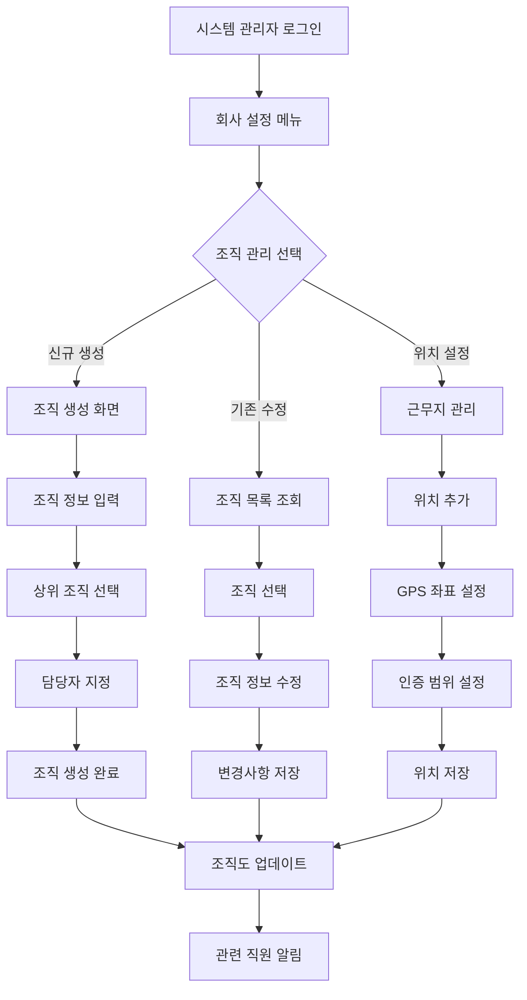

# ClockBox - PRD 세부 문서 : 조직/지점 관리 ✅ 구현 완료

## 1. 개요 (Overview)
ClockBox의 조직/지점 관리 시스템이 완전히 구현되었습니다.  
회사-조직 계층 구조와 4-tier RBAC 시스템이 완전 통합되어 운영 환경에서 사용 가능합니다.

### 구현 완료된 목적 ✅
- **회사-조직 계층 구조**: 완전한 hierarchical 관리 시스템
- **사용자 관리 통합**: 조직별 사용자 배정 및 관리
- **권한 기반 접근**: 조직별 관리자 권한 체계
- **실시간 데이터 동기화**: 조직 변경 시 즉시 반영

## 1-1. 조직 관리 시스템 구현 상태 ✅

### 완전히 구현된 조직 관리 기능
| 기능 | 구현 상태 | 구현 위치 | 설명 |
|------|----------|-----------|------|
| 회사 정보 관리 | ✅ 100% | `/system/company` | 단일 회사 정보 표시 및 관리 |
| 조직 계층 구조 | ✅ 100% | 데이터베이스 스키마 | companies → organizations 관계 |
| 조직별 사용자 배정 | ✅ 100% | `/system/users` | 계층적 드롭다운 선택 |
| 조직 정보 표시 | ✅ 100% | 사용자 목록 | 각 사용자의 소속 조직 표시 |
| 관리자 권한 체계 | ✅ 100% | `manager_id` 시스템 | 조직 내 관리자 관계 설정 |

### 데이터베이스 구현 ✅
```sql
-- companies 테이블 (완전 구현)
CREATE TABLE companies (
  id UUID PRIMARY KEY DEFAULT gen_random_uuid(),
  name TEXT NOT NULL,
  description TEXT,
  status company_status_enum DEFAULT 'active',
  created_at TIMESTAMP DEFAULT now(),
  updated_at TIMESTAMP DEFAULT now()
);

-- organizations 테이블 (완전 구현)  
CREATE TABLE organizations (
  id UUID PRIMARY KEY DEFAULT gen_random_uuid(),
  company_id UUID REFERENCES companies(id) NOT NULL,
  name TEXT NOT NULL,
  description TEXT,
  parent_id UUID REFERENCES organizations(id),
  manager_id UUID REFERENCES employees(id),
  status organization_status_enum DEFAULT 'active',
  created_at TIMESTAMP DEFAULT now(),
  updated_at TIMESTAMP DEFAULT now()
);

-- 계층적 관계 및 RLS 정책 완전 구현
```

### 프론트엔드 구현 ✅
- **회사 페이지**: `/system/company`에서 단일 회사 정보 관리
- **조직 선택**: 사용자 생성/편집 시 계층적 조직 드롭다운
- **조직 표시**: 사용자 목록에서 소속 조직명 실시간 표시
- **반응형 UI**: 모바일/데스크톱 최적화된 인터페이스

### API 통합 ✅
- **조직 데이터 조회**: RPC 함수에서 조직 정보 포함
- **회사-조직 연동**: 계층적 데이터 자동 로딩
- **권한 기반 필터링**: 역할별 조직 데이터 접근 제어

---

## 2. UI Flow 다이어그램



### 화면 구성 예시

**조직 생성 화면**
```
┌─────────────────────────────────────┐
│ 조직 생성                           │
├─────────────────────────────────────┤
│ 조직명: [                 ]         │
│ 조직 유형: ○본사 ○지점 ○부서      │
│ 상위 조직: [드롭다운] ABC회사 본사  │
│ 관리자: [검색] 홍길동 부장         │
│ 주소: [                           ] │
│ 전화번호: [                       ] │
│ 설명: [                           ] │
│                                    │
│ [생성] [취소]                      │
└─────────────────────────────────────┘
```

## 3. 사용자 시나리오 (User Flow)

### 시나리오 A: 기본 조직 구조 설정
1. **시스템 관리자 로그인**: 관리자 권한으로 시스템 접속
2. **조직 관리 메뉴**: 회사 설정 > 조직 관리 선택
3. **본사 확인**: 회사 생성시 자동 생성된 본사 조직 확인
4. **지점 추가**: "신규 조직 생성" 버튼 클릭 후 지점 정보 입력
5. **부서 생성**: 지점 하위에 영업부, 관리부 등 부서 구성
6. **담당자 지정**: 각 조직의 관리자 및 담당자 배정
7. **조직도 확인**: 생성된 조직 구조를 트리 형태로 확인

### 시나리오 B: 근무지 위치 관리
1. **근무지 관리 선택**: 조직 관리 > 근무지 관리 메뉴
2. **위치 추가**: "새 근무지 추가" 버튼 클릭
3. **기본 정보 입력**: 근무지명, 주소, 연락처 입력
4. **GPS 좌표 설정**: 지도에서 정확한 위치 선택
5. **인증 범위 설정**: 출퇴근 인정 반경 설정 (50m-200m)
6. **추가 인증 수단**: Wi-Fi SSID 등록 (선택사항)
7. **저장 및 테스트**: 설정 저장 후 위치 인증 테스트

### 시나리오 C: 조직 관리자 권한 설정
1. **권한 관리 접근**: 조직 관리 > 권한 설정 메뉴
2. **조직 선택**: 권한을 설정할 조직 선택
3. **관리자 지정**: 조직별 관리자 지정 및 변경
4. **권한 범위 설정**: 관리자가 관리할 수 있는 기능 범위 설정
5. **하위 조직 권한**: 하위 조직에 대한 권한 포함 여부 결정
6. **임시 권한**: 필요시 임시 관리자 및 기간 설정
7. **설정 저장**: 권한 설정 저장 및 해당자에게 알림 발송

---

## 4. 기능 정의 (Feature Definition)

### 기본 조직 관리 기능
- **[FR-ORG-001] 조직 구조 관리**
  - 본사 > 지점 > 부서 계층 구조 생성 및 관리
  - 조직도 트리 형태 시각화
  - 조직 정보 생성, 수정, 비활성화
  - 조직 변경 이력 추적
  
- **[FR-ORG-002] 조직 정보 관리**
  - 조직명, 주소, 연락처 등 기본 정보 관리
  - 조직별 담당자 및 관리자 지정
  - 조직 설명 및 비고사항 관리
  - 조직 활성/비활성 상태 관리

### 근무지 위치 관리
- **[FR-ORG-003] 위치 정보 관리**
  - GPS 좌표 기반 근무지 위치 설정
  - 지도 연동을 통한 시각적 위치 확인
  - 출퇴근 인정 반경 설정 (50m-200m)
  - 근무지별 주소 및 상세 위치 정보
  
- **[FR-ORG-004] 위치 인증 수단**
  - GPS 기반 위치 인증 (기본)
  - Wi-Fi SSID 기반 보조 인증
  - 수동 체크인 옵션 (예외상황 대응)
  - 위치 인증 실패시 관리자 승인 프로세스

### 권한 및 관리자 기능
- **[FR-ORG-005] 조직별 관리자 권한**
  - 조직별 관리자 지정 및 변경
  - 관리자 권한 범위 설정 (해당 조직 및 하위 조직)
  - 임시 관리자 지정 기능
  - 권한 변경 이력 추적
  
- **[FR-ORG-006] 직원 조직 배정**
  - 직원의 소속 조직 지정
  - 다중 조직 소속 관리 (겸직 허용)
  - 주 소속 조직 설정 (급여/평가 기준)
  - 조직 이동 이력 관리

### 시스템 연동 기능
- **[FR-ORG-007] 출퇴근 시스템 연동**
  - 조직별 근무시간 정책 적용
  - 위치 기반 출퇴근 인증 연동
  - 조직별 출퇴근 통계 제공
  - 예외 상황 처리 프로세스
  
- **[FR-ORG-008] 리포팅 기능**
  - 조직별 근태 현황 리포트
  - 조직 구성원 현황 리포트
  - 조직별 출퇴근 통계
  - 관리자용 대시보드 제공

---

## 4. UI/UX 요구사항
### 조직도 시각화
- **인터랙티브 조직도**:
  - 확대/축소 가능한 트리 구조
  - 조직별 색상 코딩 (본사, 지점, 부서별)
  - 드래그 앤 드롭으로 구조 변경
  - 검색 기능으로 특정 조직/직원 빠른 찾기
- **다양한 뷰 모드**:
  - 계층형 트리뷰 (전체 구조 파악)
  - 그리드뷰 (조직별 상세 정보)
  - 지도뷰 (지역별 지점 분포)
  - 타임라인뷰 (조직 변경 이력)

### 위치 관리 인터페이스
- **지도 기반 위치 설정**:
  - Google Maps / 네이버맵 연동
  - 마커 드래그로 정확한 좌표 설정
  - 반경 표시 및 지오펜스 시각화
  - 근무지 주변 시설 정보 표시
- **위치 인증 설정**:
  - WiFi SSID 스캔 및 선택
  - QR코드 자동 생성
  - 블루투스 비콘 감지 및 등록
  - 테스트 기능으로 위치 인증 검증

### 권한 관리 대시보드
- **권한 매트릭스 뷰**:
  - 역할별 권한을 테이블 형태로 시각화
  - 체크박스로 권한 간편 설정
  - 권한 템플릿 저장/불러오기
  - 권한 변경 이력 추적
- **조직별 관리자 배치도**:
  - 조직도 위에 관리자 정보 오버레이
  - 권한 위임 관계 화살표로 표시
  - 임시 권한 및 대행 상태 아이콘

### 모바일 최적화
- **터치 친화적 인터페이스**:
  - 스와이프로 조직 간 이동
  - 롱터치로 빠른 설정 메뉴
  - 음성 명령으로 조직 검색
- **오프라인 지원**:
  - 조직도 캐시 및 오프라인 조회
  - 위치 정보 로컬 저장
  - 온라인 복귀 시 자동 동기화

---

## 5. 비즈니스 규칙
### 조직 구조 규칙
- **계층 구조 제약**:
  - 본사는 회사당 1개만 생성 가능 (최상위 조직)
  - 조직 계층 깊이는 최대 10단계까지 허용
  - 순환 참조 방지 (하위 조직이 상위 조직의 부모가 될 수 없음)
- **조직 생명주기 관리**:
  - 조직 삭제 시 하위 조직 자동 상위로 이동 또는 일괄 비활성화
  - 비활성화된 조직의 데이터는 보존, 신규 배정만 차단
  - 조직 통합 시 직원/권한 자동 이관 및 중복 제거

### 직원 배정 규칙
- **다중 소속 관리**:
  - 하나의 직원은 여러 조직에 동시 소속 가능 (겸직 허용)
  - 주 소속 조직 1개 필수 지정 (급여, 평가 기준)
  - 조직별 근무 비율 설정 (주 50%, 부 30%, 지원 20% 등)
- **권한 상속 규칙**:
  - 하위 조직 관리자는 상위 조직에서 권한 자동 상속
  - 교차 배정 시 가장 높은 권한 레벨 적용
  - 임시 권한은 정규 권한보다 우선 적용

### 위치 및 보안 규칙
- **위치 인증 정책**:
  - GPS 정확도 오차 범위: 10m-500m (조직별 설정 가능)
  - 실내 근무지는 WiFi/Beacon 우선, GPS 보조 사용
  - 개인정보보호를 위한 위치 추적 동의 필수
- **보안 및 접근 제어**:
  - 관리자 권한 변경 시 상위 관리자 승인 필수
  - 민감한 조직 정보 접근 시 추가 인증 (OTP, 생체인증)
  - 권한 변경 후 24시간 내 감사 로그 자동 생성

### 데이터 보존 및 규정 준수
- **데이터 보관 정책**:
  - 조직 변경 이력 최소 3년 보관
  - 직원 배정 이력 퇴사 후 5년 보관
  - GDPR/개인정보보호법 준수를 위한 자동 익명화
- **규정 준수**:
  - 근로기준법상 사업장 단위 관리 지원
  - 조직별 최소/최대 인원 설정 (안전/효율성 고려)
  - 법정 의무 조직 (산업안전보건위원회 등) 자동 생성

---

## 6. 데이터 모델링 (초안)
### orgs 테이블
| 컬럼명 | 타입 | 설명 |
|--------|------|------|
| id | PK | 조직 ID |
| company_id | FK(companies.id) | 회사 ID |
| name | string | 조직명 |
| type | enum(head, branch, dept) | 본사/지점/부서 |
| parent_id | FK(orgs.id) | 상위 조직 |
| status | enum(active, inactive) | 상태 |
| created_at | datetime | 생성일 |

### org_locations 테이블
| 컬럼명 | 타입 | 설명 |
|--------|------|------|
| id | PK | 장소 ID |
| org_id | FK(orgs.id) | 조직 ID |
| gps_lat | float | 위도 |
| gps_lng | float | 경도 |
| wifi_ssid | string | 와이파이 SSID |
| created_at | datetime | 등록일 |

---

## 7. 알림 및 연동
### 기본 알림 시스템
- **조직 변경 알림**:
  - 조직 구조 변경 시 영향받는 모든 구성원에게 알림
  - 권한 변경 시 실시간 푸시 알림 및 이메일 발송
  - 새로운 관리자 임명 시 조직 구성원 공지
  - 임시 권한 만료 30분 전 사전 알림
- **위치 기반 알림**:
  - 새로운 근무지 등록 시 해당 조직원 알림
  - 지오펜스 진입/이탈 시 관리자 실시간 알림
  - 비인가 위치에서 접근 시도 시 보안 알림
- **정기 리포트 알림**:
  - 주간/월간 조직별 현황 요약 자동 발송
  - 조직 효율성 분석 결과 경영진 리포트
  - 권한 감사 리포트 정기 발송

### 외부 시스템 통합
- **HR 시스템 연동**:
  - ERP의 인사정보와 실시간 동기화
  - 조직도 변경 시 급여시스템 자동 업데이트
  - 평가시스템과 조직별 KPI 연동
- **보안 시스템 연동**:
  - 카드키/출입통제 시스템과 권한 동기화
  - CCTV 시스템과 위치 인증 연계
  - VPN 접근 권한 조직별 자동 관리
- **커뮤니케이션 도구 연동**:
  - Slack/Teams 채널 조직 구조별 자동 생성
  - 이메일 그룹 조직도 기반 자동 관리
  - 화상회의 권한 조직별 자동 설정
- **클라우드 서비스 연동**:
  - Google Workspace/Microsoft 365 조직 동기화
  - 클라우드 스토리지 폴더 구조 자동 생성
  - 조직별 리소스 사용량 모니터링

### API 및 웹훅
- **실시간 데이터 동기화**:
  - 조직 변경 시 외부 시스템 웹훅 트리거
  - RESTful API로 조직 정보 실시간 조회/수정
  - GraphQL 지원으로 필요 데이터만 선택적 조회
- **배치 처리**:
  - 대량 조직 변경 시 배치 API 제공
  - CSV/Excel 파일 기반 일괄 업로드
  - 변경 시뮬레이션 및 롤백 기능

---

## 8. 예외 및 에러 처리
| 케이스 | 조건 | 시스템 동작 | 사용자 메시지 |
|--------|------|------------|--------------|
| 중복 지점명 | 동일 회사 내 중복 | 생성 차단 | “이미 존재하는 지점명입니다.” |
| 본조직 삭제 | type=head 삭제 요청 | 차단 | “본조직은 삭제할 수 없습니다.” |
| 위치 정보 없음 | GPS/WiFi 미입력 | 저장 차단 | “출퇴근 인증 위치를 입력해주세요.” |
| 지점 관리자 미지정 | 지점에 관리자 없음 | 경고 | “지점 관리자를 반드시 지정해야 합니다.” |

---

## 9. 연관성 (Dependency & Integration)
- **시작하기 (prd_start.md)**: 회사 생성 시 본조직 자동 생성
- **출퇴근기록 (prd_attendance.md)**: 지점별 위치 기반 출퇴근 인증
- **직원 (prd_employee.md)**: 직원 지점 배정/관리
- **리포트 (prd_report.md)**: 지점별 근태 통계 제공

---

## 10. 성공 지표 (KPI)
### 운영 효율성 지표
- **조직 관리 효율성**:
  - 조직 생성 후 직원 배정 완료율 ≥ 95%
  - 조직 구조 변경 시 영향 범위 예측 정확도 ≥ 90%
  - 권한 설정 완료 시간 ≤ 5분 (평균)
- **위치 인증 정확성**:
  - 출퇴근 기록의 위치 매칭 정확도 ≥ 99.5%
  - GPS 기반 인증 성공률 ≥ 95% (야외)
  - WiFi/Beacon 기반 인증 성공률 ≥ 99% (실내)
- **시스템 성능**:
  - 조직도 로딩 시간 ≤ 2초 (1000명 기준)
  - 대량 조직 변경 처리 시간 ≤ 30초 (100개 조직)
  - API 응답 시간 ≤ 500ms (99% 기준)

### 사용자 만족도 지표
- **관리자 효율성**:
  - 조직 관리 작업 시간 50% 단축 (기존 대비)
  - 권한 설정 오류율 ≤ 2%
  - 관리자 만족도 ≥ 4.5/5.0
- **직원 사용성**:
  - 조직도 검색 성공률 ≥ 95%
  - 위치 인증 실패로 인한 문의 ≤ 1% (월간)
  - 모바일 앱 조직 기능 만족도 ≥ 4.0/5.0

### 보안 및 컴플라이언스 지표
- **보안 지표**:
  - 무권한 조직 정보 접근 차단율 100%
  - 권한 변경 감사 로그 누락률 0%
  - 위치 스푸핑 탐지율 ≥ 99%
- **컴플라이언스 지표**:
  - 개인정보보호 정책 준수율 100%
  - 조직 변경 승인 워크플로우 준수율 100%
  - 데이터 백업 성공률 ≥ 99.9%

### 비즈니스 임팩트 지표
- **조직 효율성 개선**:
  - 조직별 생산성 가시성 개선 ≥ 80%
  - 인력 배치 최적화를 통한 비용 절감 ≥ 15%
  - 조직 변경 적응 시간 50% 단축
- **확장성 지표**:
  - 동시 접속자 1000명 지원
  - 조직 수 10,000개까지 확장 가능
  - 다국적 기업 지원 (시간대 10개 이상)
