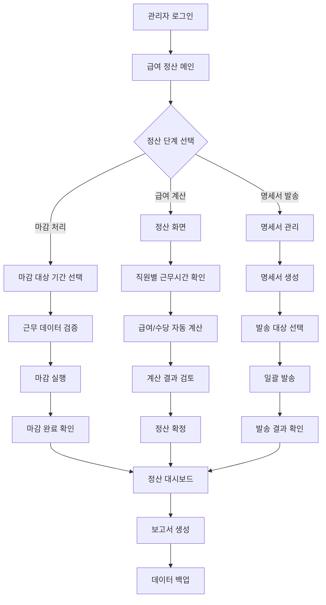

# ClockBox - PRD 세부 문서 : 마감 및 정산 (Payroll)

## 1. 개요 (Overview)
ClockBox의 마감 및 정산(Payroll) 기능은 확정된 근무기록, 휴가, 연장/야간근로를 기반으로 급여 및 수당을 자동 산출하고, 명세서를 발송한다.

### 목적
- 급여 및 수당 계산 자동화  
- 근로기준법/최저임금 준수  
- 투명한 급여 지급 및 정산 기록 관리  

---

## 2. UI Flow 다이어그램



### 화면 구성 예시

**급여 정산 화면**
```
┌─────────────────────────────────────────────────────────────────┐
│ 급여 정산 - 2024년 3월                                         │
├─────────────────────────────────────────────────────────────────┤
│ 정산 진행 상태: ■■■■■■□□□□ (60% 완료)                    │
│                                                                 │
│ ┌─ 마감 처리 ─────────────────────────────────────────────────┐ │
│ │ 대상 기간: 2024-03-01 ~ 2024-03-31               [완료]    │ │
│ │ 총 직원 수: 150명 | 마감 완료: 150명                       │ │
│ └─────────────────────────────────────────────────────────────┘ │
│                                                                 │
│ ┌─ 급여 계산 ─────────────────────────────────────────────────┐ │
│ │ 기본급 계산: [진행 중]  연장 수당: [완료]                  │ │
│ │ 야간 수당: [완료]      휴일 수당: [대기]                   │ │
│ │ 예상 총 급여: ₩385,420,000 (전월 대비 +2.3%)              │ │
│ └─────────────────────────────────────────────────────────────┘ │
│                                                                 │
│ ┌─ 예외 사항 ─────────────────────────────────────────────────┐ │
│ │ • 김직원(D001): 연장근로 52시간 초과 확인 필요             │ │
│ │ • 이사원(D015): 야간근로 미승인 건 3회                     │ │
│ │                                   [상세보기] [처리완료]     │ │
│ └─────────────────────────────────────────────────────────────┘ │
│                                                                 │
│             [급여계산 실행] [미리보기] [정산 확정]              │
└─────────────────────────────────────────────────────────────────┘
```

---

## 3. 사용자 시나리오 (User Flow)

### 시나리오 A: 기본 급여 마감 처리
1. **관리자 로그인**: 관리자 권한으로 ClockBox 시스템 접속
2. **마감 대상 기간 설정**: 정산할 월 또는 기간 선택 (예: 2024년 3월)
3. **근무 데이터 검증**: 해당 기간 모든 직원의 출퇴근, 휴가, 연장근로 데이터 확인
4. **예외 사항 처리**: 미처리된 출퇴근 기록이나 승인 대기 중인 요청 처리
5. **마감 실행**: 모든 근무 데이터 확정 및 수정 불가 상태로 전환
6. **마감 완료 확인**: 마감 처리 결과 및 총 근무시간 통계 확인
7. **관련자 알림**: 마감 완료를 HR 담당자 및 경영진에게 알림

### 시나리오 B: 급여 및 수당 자동 계산
1. **관리자 로그인**: 관리자 권한으로 ClockBox 시스템 접속
2. **정산 화면 진입**: 마감 완료된 데이터를 기반으로 정산 화면 접속
3. **직원별 근무시간 확인**: 각 직원의 정규근로, 연장근로, 야간근로, 휴일근로 시간 확인
4. **기본급 계산**: 각 직원의 기본급 및 고정 수당 자동 계산
5. **연장 수당 계산**: 연장근로 시간에 따른 1.5배 수당 자동 계산
6. **야간/휴일 수당 계산**: 야간근로(0.5배), 휴일근로(1.5배) 수당 자동 계산
7. **최저임금 검증**: 계산된 급여가 최저임금 기준을 충족하는지 자동 검증
8. **계산 결과 검토**: 전체 급여 계산 결과 및 예외 사항 확인
9. **정산 확정**: 최종 급여 계산 결과 확정 및 저장

### 시나리오 C: 급여명세서 생성 및 발송
1. **관리자 로그인**: 관리자 권한으로 ClockBox 시스템 접속
2. **명세서 생성 화면 진입**: 정산 완료된 데이터를 기반으로 명세서 생성 메뉴 선택
3. **명세서 템플릿 선택**: 회사별 급여명세서 양식 선택 또는 커스터마이징
4. **발송 대상 선택**: 전체 직원 또는 특정 부서/개별 직원 선택
5. **개인정보 보안 설정**: 명세서 접근용 비밀번호 설정 (주민번호 뒤 4자리 등)
6. **PDF 명세서 생성**: 직원별 개별 급여명세서 PDF 파일 자동 생성
7. **발송 채널 선택**: 이메일, 메시지, 모바일 앱 푸시 중 발송 방식 선택
8. **일괄 발송 실행**: 선택된 채널로 전체 직원에게 명세서 동시 발송
9. **발송 결과 확인**: 발송 성공/실패 현황 및 직원별 확인 상태 모니터링

### 시나리오 D: 직원 급여 조회 및 문의 처리
1. **직원 로그인**: 직원이 개인 계정으로 ClockBox 시스템 접속
2. **급여명세서 조회**: 과거 및 최신 급여명세서 다운로드 및 온라인 조회
3. **급여 구성 상세 확인**: 기본급, 각종 수당, 공제 내역 상세 확인
4. **근무시간 연계 조회**: 자신의 근무시간과 급여 계산 간 연계성 확인
5. **급여 이력 조회**: 과거 3년간 급여 변동 이력 및 그래프 확인
6. **질의 및 문의 제기**: 급여에 대한 질문이나 이의제기 양식 작성
7. **반렵 및 피드백**: HR 담당자로부터 답변 및 해결 현황 확인

### 시나리오 E: 급여 데이터 분석 및 보고
1. **관리자 로그인**: 관리자 권한으로 ClockBox 시스템 접속
2. **급여 분석 대시보드 진입**: 급여 통계 및 분석 메뉴 선택
3. **기간별 급여 통계**: 월별, 분기별, 연별 급여 지출 통계 확인
4. **부서별 급여 분석**: 각 부서별 급여 비중 및 수당 구성 비교
5. **개인별 급여 순위**: 급여 수준별 직원 분배 및 통계 정보
6. **최저임금 준수 현황**: 최저임금 기준 대비 급여 수준 분석
7. **비용 예산 대비 실적**: 예산 대비 실제 지출된 급여 비용 분석
8. **보고서 다운로드**: Excel, PDF 형식의 급여 분석 보고서 다운로드  

---

## 3. 기능 정의 (Feature Definition)
- **[FR-PAY-001] 근무데이터 마감 처리**  
- **[FR-PAY-002] 급여/수당 정산 자동화**  
- **[FR-PAY-003] 주휴수당 및 최저임금 검증**  
- **[FR-PAY-004] 급여명세서 PDF 생성/발송**  
- **[FR-PAY-005] 정산 기록 보관/조회**

### 🇰🇷 한국 특화 급여 체계
- **[FR-PAY-006] 한국식 수당 체계 완전 지원**
  - **연장근무수당**: 1.5배 차등 적용 (평일/토요일)
  - **야간근무수당**: 기본급의 0.5배 추가 (22:00-06:00)
  - **휴일근무수당**: 1.5배 적용 (일요일/법정공휴일)
  - **주휴수당**: 주 15시간 이상 근무자 자동 계산
  - **월차수당**: 미사용 월차의 수당화 처리
  - **생리휴가수당**: 여성 직원 월 1일 유급휴가

- **[FR-PAY-007] 2025년 최저임금 완벽 준수**
  - **실시간 검증**: 시급 10,030원 기준 자동 체크
  - **미달 시 보정**: 최저임금 미달 시 자동 보전 계산
  - **주휴수당 연동**: 주 15시간 이상 시 주휴수당 의무 적용
  - **수습자 적용**: 수습기간 3개월, 10% 감액 한도

- **[FR-PAY-008] 출산/육아 관련 특별수당**
  - **출산휴가**: 90일 → 100일 연장 (2025년 개정법)
  - **배우자 출산휴가**: 10일 → 20일 연장
  - **육아휴직**: 12개월 → 18개월 확대
  - **육아기 근로시간 단축**: 주 35시간 제한  

---

## 4. UI/UX 요구사항
- 마감 실행 화면: 기간 선택, 진행률 표시  
- 정산 결과표: 직원별 근로시간/급여/수당 상세  
- 명세서 다운로드: PDF, Excel 지원  

---

## 5. 비즈니스 규칙
- 마감 후 데이터 수정 불가 (단, 관리자 override 가능)  
- 최저임금 자동 검증  
- 수당 계산은 근로기준법 규칙 자동 반영  
- 정산 기록 최소 5년 보관  

---

## 6. 데이터 모델링 (초안)
### payrolls 테이블
| 컬럼명 | 타입 | 설명 |
|--------|------|------|
| id | PK | 정산 ID |
| company_id | FK(companies.id) | 회사 |
| period_start | datetime | 시작일 |
| period_end | datetime | 종료일 |
| total_hours | int | 총 근로시간 |
| overtime_hours | int | 연장근로 |
| holiday_hours | int | 휴일근로 |
| night_hours | int | 야간근로 |
| total_pay | int | 총 급여 |
| created_at | datetime | 생성일 |

### payslips 테이블
| 컬럼명 | 타입 | 설명 |
|--------|------|------|
| id | PK | 명세서 ID |
| payroll_id | FK(payrolls.id) | 정산 ID |
| employee_id | FK(employees.id) | 직원 |
| base_pay | int | 기본급 |
| overtime_pay | int | 연장 수당 |
| holiday_pay | int | 휴일 수당 |
| night_pay | int | 야간 수당 |
| total_amount | int | 총액 |
| sent_at | datetime | 발송일 |

---

## 7. 알림 및 연동
- 마감 완료 시 관리자 알림  
- 급여명세서 발송 시 직원 알림  
- ERP/회계 시스템 연동 API 제공  

---

## 8. 예외 및 에러 처리
| 케이스 | 조건 | 시스템 동작 | 사용자 메시지 |
|--------|------|------------|--------------|
| 미마감 상태 정산 | 마감 처리 전 | 차단 | “마감 후 정산이 가능합니다.” |
| 근로시간 오류 | 출퇴근/휴가 데이터 불일치 | 검증 실패 | “근로시간 데이터 오류가 발생했습니다.” |
| 명세서 발송 실패 | 이메일/푸시 오류 | 재시도 | “급여명세서 발송에 실패했습니다. 다시 시도합니다.” |

---

## 9. 연관성 (Dependency & Integration)
- **출퇴근기록 (prd_attendance.md)**: 근로시간 데이터 반영  
- **휴가 (prd_leave.md)**: 유급/무급 반영  
- **요청 (prd_request.md)**: 승인된 변경 요청 반영  
- **리포트 (prd_report.md)**: 정산 데이터 보고서 제공  
- **메시지 (prd_message.md)**: 명세서 발송 알림  

---

## 10. 성공 지표 (KPI)
- 정산 오류율 ≤ 1%  
- 마감 처리 평균 시간 ≤ 10분  
- 명세서 발송 성공률 ≥ 99%  
