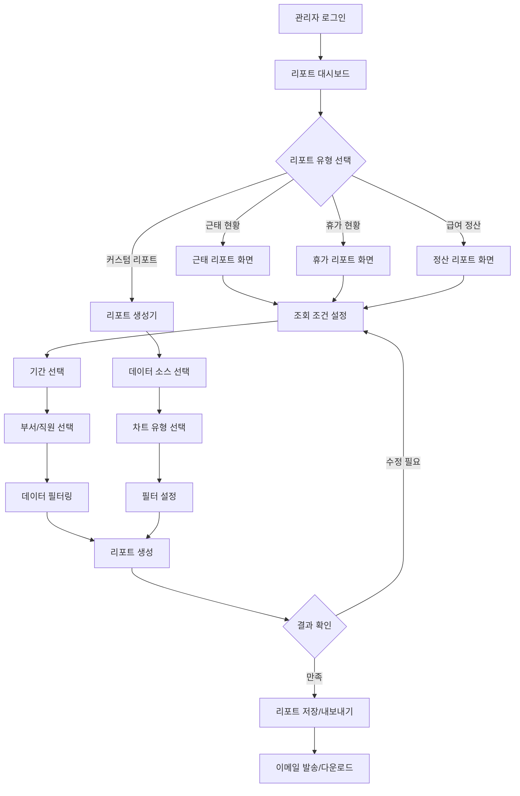

# ClockBox - PRD 세부 문서 : 리포트 (Report)

## 1. 개요 (Overview)
ClockBox의 리포트(Report) 기능은 근태, 휴가, 요청, 정산 데이터를 기반으로 통계 및 분석 리포트를 제공한다.

### 목적
- 경영진/관리자의 **데이터 기반 의사결정 지원**
- 법적 근거 자료 및 리스크 관리
- 급여/정산 데이터 제공

---

## 2. UI Flow 다이어그램



### 화면 구성 예시

**리포트 대시보드 메인 화면**
```
┌─────────────────────────────────────────────────────────────────┐
│ ClockBox 리포트 대시보드                              [2024.03] │
├─────────────────────────────────────────────────────────────────┤
│ 📊 오늘의 현황                                                   │
│ ┌──────────┬──────────┬──────────┬──────────┐                 │
│ │ 출근율   │ 지각률   │ 휴가자   │ 초과근무 │                 │
│ │  95.2%   │  2.1%    │  8명     │  15명    │                 │
│ └──────────┴──────────┴──────────┴──────────┘                 │
│                                                                 │
│ 🔍 빠른 리포트 생성                                             │
│ [근태 현황] [휴가 현황] [정산 데이터] [커스텀 리포트]            │
│                                                                 │
│ 📈 최근 생성한 리포트                                           │
│ • 3월 1주차 부서별 근태 현황                          [다운로드] │
│ • 2024년 2월 급여 정산 리포트                         [다운로드] │
│ • 개발팀 연차 사용 현황                               [다운로드] │
└─────────────────────────────────────────────────────────────────┘
```

## 3. 사용자 시나리오 (User Flow)

### 시나리오 A: 기본 근태 현황 리포트 생성
1. **관리자 로그인**: 관리자 권한으로 ClockBox 시스템 접속
2. **대시보드 접근**: 메인 메뉴에서 "리포트" 선택하여 대시보드 진입
3. **리포트 유형 선택**: "근태 현황" 리포트 선택
4. **조회 조건 설정**: 기간(이번 달), 대상 부서(전체 또는 특정 부서) 선택
5. **상세 필터 설정**: 출근율, 지각률, 조퇴율 등 보고 싶은 지표 선택
6. **리포트 생성**: "리포트 생성" 버튼 클릭하여 데이터 집계
7. **결과 확인**: 생성된 차트와 표를 통해 근태 현황 분석
8. **리포트 저장**: 필요시 PDF/Excel 형태로 다운로드 또는 이메일 발송

### 시나리오 B: 휴가 사용 현황 분석
1. **휴가 리포트 선택**: 리포트 대시보드에서 "휴가 현황" 선택
2. **분석 기간 설정**: 연간/분기/월간 중 분석하고자 하는 기간 선택
3. **부서별/개인별 선택**: 전사 현황 또는 특정 부서/개인 현황 선택
4. **휴가 유형 필터**: 연차, 병가, 경조휴가 등 분석할 휴가 유형 선택
5. **데이터 시각화**: 바차트, 파이차트 등으로 휴가 사용 패턴 확인
6. **잔여 연차 확인**: 직원별 잔여 연차 및 사용률 분석
7. **알림 설정**: 연차 소진 필요 직원에 대한 자동 알림 설정

### 시나리오 C: 급여 정산 리포트 생성
1. **정산 리포트 접근**: "급여 정산" 리포트 메뉴 선택
2. **정산 기간 선택**: 월간 급여 정산 기간 선택 (예: 2024년 3월)
3. **포함 항목 설정**: 기본급, 야근수당, 휴일근무수당, 각종 수당 포함 여부
4. **부서별 집계**: 부서별 총 인건비 및 개인별 상세 내역 확인
5. **세금 및 공제**: 소득세, 4대보험 등 공제 항목 자동 계산
6. **검증 및 확인**: 계산 결과 검토 및 오류 확인
7. **급여 명세서 생성**: 개별 직원용 급여 명세서 일괄 생성
8. **회계 시스템 연동**: ERP 시스템으로 급여 데이터 전송

### 시나리오 D: 커스텀 리포트 생성
1. **리포트 생성기 접근**: "커스텀 리포트" 메뉴 선택
2. **데이터 소스 선택**: 출퇴근 기록, 휴가 신청, 초과근무 등 필요한 데이터 선택
3. **차트 유형 선택**: 막대그래프, 선그래프, 파이차트, 표 등 시각화 방법 선택
4. **필터 조건 설정**: 기간, 부서, 직급, 근무형태 등 다양한 필터 조건 설정
5. **그룹핑 설정**: 부서별, 월별, 요일별 등 데이터 그룹핑 방식 선택
6. **미리보기**: 설정한 조건으로 샘플 리포트 미리보기
7. **리포트 템플릿 저장**: 향후 재사용을 위해 리포트 템플릿으로 저장
8. **정기 리포트 설정**: 매주/매월 자동 생성 및 발송 설정  

---

## 4. 기능 정의 (Feature Definition)

### 기본 리포트 생성 기능
- **[FR-REP-001] 표준 리포트 템플릿**
  - 근태 현황 리포트 (출근율, 지각률, 조퇴율, 결근율)
  - 휴가 사용 현황 리포트 (연차 사용률, 잔여 연차, 휴가 유형별 통계)
  - 초과근무 현황 리포트 (부서별/개인별 야근 시간, 휴일근무 현황)
  - 급여 정산 리포트 (기본급, 각종 수당, 공제액, 실수령액)
  
- **[FR-REP-002] 커스텀 리포트 생성기**
  - 드래그 앤 드롭 방식의 직관적 리포트 생성 인터페이스
  - 다양한 데이터 소스 조합 (출퇴근, 휴가, 급여, 요청 데이터)
  - 필터링 및 그룹핑 옵션 (부서별, 기간별, 직급별 등)
  - 차트 유형 선택 (막대그래프, 선그래프, 파이차트, 테이블)

### 데이터 시각화 및 분석
- **[FR-REP-003] 기본 차트 및 시각화**
  - 반응형 차트 라이브러리 (Chart.js 기반)
  - 인터랙티브 차트 (확대/축소, 드릴다운)
  - 색상 테마 및 브랜딩 커스터마이제이션
  - 모바일 최적화 차트 렌더링
  
- **[FR-REP-004] 데이터 필터링 및 정렬**
  - 다중 조건 필터링 (AND/OR 조건 지원)
  - 날짜 범위 선택기 (캘린더 UI)
  - 부서/직원 다중 선택 필터
  - 실시간 필터 적용 및 결과 업데이트

### 리포트 관리 및 배포
- **[FR-REP-005] 리포트 저장 및 내보내기**
  - PDF, Excel, CSV 형식 내보내기
  - 리포트 템플릿 저장 및 재사용
  - 즐겨찾기 리포트 관리
  - 리포트 생성 이력 관리
  
- **[FR-REP-006] 정기 리포트 자동화**
  - 스케줄 기반 자동 리포트 생성 (일간/주간/월간)
  - 이메일 자동 발송 기능
  - 리포트 수신자 그룹 관리
  - 실패 시 재시도 및 알림 기능

### 권한 및 보안
- **[FR-REP-007] 접근 권한 관리**
  - 역할 기반 리포트 접근 제어
  - 부서별 데이터 접근 제한
  - 개인정보 마스킹 (민감 정보 보호)
  - 리포트별 읽기/쓰기 권한 설정
  
- **[FR-REP-008] 감사 로그**
  - 리포트 생성/조회 이력 추적
  - 데이터 내보내기 로그 기록
  - 사용자별 접근 로그 관리
  - 보안 이벤트 모니터링

### 시스템 연동
- **[FR-REP-009] 외부 시스템 연동**
  - ERP 시스템 데이터 연동
  - 회계 시스템 급여 데이터 전송
  - API를 통한 실시간 데이터 동기화
  - 웹훅 기반 이벤트 알림
  
- **[FR-REP-010] 대시보드 및 알림**
  - 관리자용 실시간 현황 대시보드
  - 임계치 기반 자동 알림 (출근율 저하, 초과근무 증가 등)
  - 모바일 푸시 알림 지원
  - 슬랙/Teams 등 메신저 연동

---

## 4. UI/UX 요구사항

### 기본 리포트 대시보드 인터페이스
- **사용자별 대시보드**:
  - 관리자/팀장/직원별 권한에 따른 데이터 접근 제어
  - 개인 설정 가능한 위젯 배치 (드래그 앤 드롭)
  - 자주 사용하는 리포트 즐겨찾기 기능
  - 기간별 필터링 (일/주/월/분기/년)

- **차트 및 시각화**:
  - 기본 차트 유형: 막대, 선, 원형, 표 형태
  - 데이터 내보내기 (Excel, PDF, CSV)
  - 인쇄 친화적 레이아웃 자동 변환
  - 반응형 디자인으로 모바일 지원

### 기본 리포트 생성 도구
- **간단한 리포트 빌더**:
  - 드래그 앤 드롭으로 데이터 필드 선택
  - 기본 집계 함수 (합계, 평균, 개수)
  - 날짜 범위 및 부서/직원 필터링
  - 실시간 미리보기 기능

- **정형 리포트 템플릿**:
  - 미리 정의된 표준 리포트 양식 제공
  - 월간/주간 정기 리포트 자동 생성
  - 이메일 자동 발송 기능
  - 리포트 히스토리 및 버전 관리

### 협업 중심 리포팅 플랫폼
- **실시간 동시편집 환경**:
  - Google Docs 수준의 실시간 다중 사용자 리포트 편집
  - 실시간 커서 추적 및 사용자별 색상 구분
  - 음성/텍스트 주석 및 하이라이트 기능
  - 버전 관리 및 변경사항 자동 추적

- **메타버스 회의실 통합**:
  - VR 환경에서 전세계 팀원들과 데이터 기반 가상 회의
  - 3D 공간에서 데이터 시각화를 중심으로 한 몰입형 프레젠테이션
  - 가상 화이트보드와 연동한 브레인스토밍 세션
  - 회의 내용 자동 기록 및 액션 아이템 추출

### 모바일 퍼스트 및 크로스 디바이스
- **통합 멀티 디바이스 경험**:
  - 모바일, 태블릿, PC에서 기본 동기화 지원
  - 디바이스 간 끊김없는 작업 전환 (Continuity)
  - 오프라인 모드에서도 핵심 기능 사용 가능
  - 5G 네트워크 최적화로 실시간 대용량 데이터 스트리밍

- **웨어러블 및 IoT 통합**:
  - Apple Watch/Galaxy Watch에서 핵심 KPI 모니터링
  - 대화형 디스플레이를 위한 보고서 전시 모드
  - 차량 내 HUD(Head-Up Display) 연동으로 이동 중 정보 확인
  - 모바일 알림으로 리포트 완료 알림 제공  

---

## 5. 비즈니스 규칙
- 리포트 조회 권한은 관리자만 가능  
- 데이터는 실시간 집계, 단 스냅샷은 특정 시점 데이터로 고정  
- 스냅샷은 최소 1년 보관  

---

## 6. 데이터 모델링 (초안)
리포트는 별도 테이블 대신 **집계 뷰/ETL 파이프라인** 활용  
- `report_attendance_view`  
- `report_leave_view`  
- `report_payroll_view`  

스냅샷 저장용 테이블 제공: `report_snapshots`  

---

## 7. 알림 및 연동
- 정기 리포트 메일 발송 (주간/월간)  
- ERP/회계 시스템으로 데이터 연동  
- 메시지 시스템과 연결해 알림 발송  

---

## 8. 예외 및 에러 처리
| 케이스 | 조건 | 시스템 동작 | 사용자 메시지 |
|--------|------|------------|--------------|
| 데이터 없음 | 조회 조건 결과 없음 | 빈 리포트 반환 | “해당 조건의 데이터가 없습니다.” |
| 권한 없음 | 직원 계정 접근 | 차단 | “리포트 조회 권한이 없습니다.” |
| 데이터 과다 | 조회 범위 > 1년 | 차단/분할 조회 | “조회 범위를 축소해주세요.” |

---

## 9. 연관성 (Dependency & Integration)
- **출퇴근기록 (prd_attendance.md)**: 근태 통계 집계  
- **휴가 (prd_leave.md)**: 휴가 사용 통계 반영  
- **요청 (prd_request.md)**: 요청 처리 현황 반영  
- **정산 (prd_payroll.md)**: 급여 정산 데이터 제공  

---

## 10. 성공 지표 (KPI)
- 리포트 생성 평균 시간 ≤ 5초  
- 리포트 다운로드 성공률 ≥ 99%  
- 관리자 리포트 활용률 ≥ 80%  
