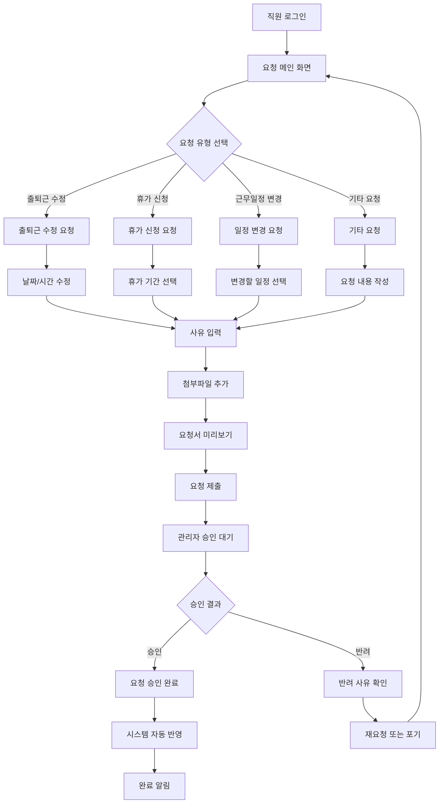

# ClockBox - PRD 세부 문서 : 요청 (Request)

## 1. 개요 (Overview)
ClockBox의 요청(Request) 기능은 직원이 근무 관련 데이터(근무일정, 출퇴근기록, 휴가 등)를 변경하거나 보완해야 할 때, 관리자의 승인 절차를 통해 투명하게 반영하는 워크플로우를 제공한다.

### 목적
- 근태/일정/휴가 등 주요 데이터 변경의 **투명성 확보**
- 승인 라인 및 규칙 기반의 **권한 관리**
- 요청/승인 데이터의 **정산 및 리포트 연동**

---

## 2. UI Flow 다이어그램



### 화면 구성 예시

**요청 작성 화면**
```
┌─────────────────────────────────────────────────────────────────┐
│ 출퇴근 수정 요청                                               │
├─────────────────────────────────────────────────────────────────┤
│ 요청일: 2024-03-15 (금)                          [달력 선택]    │
│                                                                 │
│ 현재 기록:                                                    │
│ ┌─ 출근: 미등록    퇴근: 18:30 ─────────────────────────────┐ │
│                                                                 │
│ 수정 요청:                                                    │
│ ┌─ 출근: [09:00] ▼  퇴근: [18:30] ▼ ──────────────────────┐ │
│                                                                 │
│ 사유: ┌─────────────────────────────────────────────────────┐ │
│      │ 지하철 연착으로 인한 출근 지연                        │ │
│      │ 지하철 2호선 신호 장애 (09:10 정상화)               │ │
│      └─────────────────────────────────────────────────────┘ │
│                                                                 │
│ 첨부파일: [파일 선택] • 지하철 지연증명서.pdf               │
│                                                                 │
│ 승인자: 김팀장 (자동 지정)                                  │
│                                                                 │
│                    [미리보기] [제출] [취소]                     │
└─────────────────────────────────────────────────────────────────┘
```

---

## 3. 사용자 시나리오 (User Flow)

### 시나리오 A: 출퇴근 기록 수정 요청
1. **직원 로그인**: 직원이 개인 계정으로 ClockBox 시스템 접속
2. **출퇴근 수정 요청 메뉴 선택**: 메인 화면에서 "출퇴근 수정 요청" 선택
3. **수정할 날짜 선택**: 달력에서 수정할 출퇴근 일자 선택
4. **현재 기록 확인**: 해당 일자의 기존 출퇴근 기록 확인
5. **수정 내용 입력**: 올바른 출근/퇴근 시간 입력
6. **사유 작성**: 수정 사유를 자세히 작성 (예: 지하철 연착, 병원 방문 등)
7. **첨부파일 추가**: 필요시 증빙 서류 첨부 (의료비 영수증, 지연증명서 등)
8. **요청서 제출**: 작성 완료 후 승인자에게 요청서 제출
9. **승인 대기 및 결과 확인**: 승인 결과 알림 수신 및 확인

### 시나리오 B: 근무일정 변경 요청
1. **직원 로그인**: 직원이 개인 계정으로 ClockBox 시스템 접속
2. **일정 변경 요청 메뉴 선택**: 메인 화면에서 "일정 변경 요청" 선택
3. **변경할 일정 선택**: 기존 근무일정 중에서 변경할 일정 선택
4. **새로운 일정 입력**: 변경할 새로운 근무 시간 및 날짜 입력
5. **변경 사유 작성**: 일정 변경이 필요한 이유 상세 작성
6. **영향도 확인**: 일정 변경이 팀 업무나 프로젝트에 미칠 영향 검토
7. **대체 방안 제시**: 필요시 업무 대체자나 대체 방안 제시
8. **요청서 제출**: 작성 완료 후 승인자에게 요청서 제출
9. **승인 및 일정 반영**: 승인 완료 후 시스템에 자동으로 새로운 일정 반영

### 시나리오 C: 휴가 취소 요청
1. **직원 로그인**: 직원이 개인 계정으로 ClockBox 시스템 접속
2. **휴가 취소 요청 메뉴 선택**: 메인 화면에서 "휴가 취소 요청" 선택
3. **취소할 휴가 선택**: 승인되어 예정된 휴가 목록에서 취소할 휴가 선택
4. **취소 사유 작성**: 휴가 취소가 필요한 이유 상세 작성
5. **업무 영향도 검토**: 휴가 취소로 인한 팀 업무나 프로젝트 영향 검토
6. **대체 마기리 방안**: 휴가 취소 대신 다른 날짜로 대체 휴가 가능 여부 검토
7. **요청서 제출**: 작성 완료 후 승인자에게 요청서 제출
8. **승인 및 시스템 반영**: 승인 완료 후 휴가 일정 취소 및 관련 시스템 자동 업데이트

### 시나리오 D: 관리자 승인 처리
1. **관리자 로그인**: 관리자 권한으로 ClockBox 시스템 접속
2. **요청 대기 목록 확인**: 대기 중인 직원 요청 사항 목록 확인
3. **요청 상세 내용 검토**: 각 요청에 대한 상세 내용, 사유, 첨부파일 검토
4. **규정 및 정책 확인**: 회사 규정과 정책에 따른 승인 가능 여부 판단
5. **승인/반려 결정**: 요청 내용을 바탕으로 승인 또는 반려 결정
6. **의견 또는 조건 추가**: 필요시 승인 의견이나 추가 조건 입력
7. **승인 결과 전송**: 승인 또는 반려 결과를 요청자에게 전송
8. **시스템 자동 반영**: 승인된 요청에 대해 관련 시스템에 자동 반영

### 시나리오 E: 요청 현황 조회 및 관리
1. **직원/관리자 로그인**: 개인 계정 또는 관리자 계정으로 시스템 접속
2. **내 요청 현황 조회**: 자신이 제출한 요청들의 진행 상황 확인
3. **요청 상태별 필터링**: 대기중, 승인됨, 반려됨 등 상태별로 요청 분류 조회
4. **요청 상세 내역 확인**: 각 요청의 상세 내용, 진행 과정, 승인자 의견 등 확인
5. **반려된 요청 재수정**: 반려된 요청에 대해 사유를 바탕으로 수정 후 재제출
6. **승인 완료 현황 확인**: 승인된 요청들이 실제 시스템에 반영되었는지 확인
7. **알림 내역 확인**: 요청 관련 알림 수신 내역 확인  

---

## 4. 기능 정의 (Feature Definition)
- **[FR-REQ-001] 요청서 작성/수정/삭제**  
- **[FR-REQ-002] 승인 라인 관리**  
- **[FR-REQ-003] 요청 승인/반려 처리**  
- **[FR-REQ-004] 요청 현황 조회**  
- **[FR-REQ-005] 알림 및 상태 추적**  

---

## 5. UI/UX 요구사항
- 요청서 작성 화면: 드롭다운 선택, 날짜/시간 피커 제공  
- 승인 처리 화면: 요청 내용 미리보기, 승인/반려 버튼  
- 요청 현황 조회: 상태별 필터링, 검색 기능  

---

## 6. 비즈니스 규칙
- 요청은 직원 본인만 작성 가능  
- 승인은 지정된 승인자만 가능  
- 승인 완료 후 관련 시스템 자동 반영  
- 요청/승인 기록 최소 3년 보관  

---

## 7. 데이터 모델링 (초안)
### requests 테이블
| 컬럼명 | 타입 | 설명 |
|--------|------|------|
| id | PK | 요청 ID |
| employee_id | FK(employees.id) | 요청자 |
| type | enum(attendance, schedule, leave, etc) | 요청 유형 |
| content | text | 요청 내용 |
| reason | text | 사유 |
| attachment_url | string | 첨부파일 |
| status | enum(pending, approved, rejected) | 상태 |
| approver_id | FK(employees.id) | 승인자 |
| approved_at | datetime | 승인일 |
| created_at | datetime | 생성일 |

---

## 8. 알림 및 연동
### 기본 알림
- 요청 제출시 승인자에게 알림  
- 승인/반려시 요청자에게 알림  
- 승인 완료시 관련 시스템 자동 반영

### 👥 MZ세대 맞춤 투명성 강화
- **실시간 진행상황 추적**: 
  - 요청서가 어느 단계에 있는지 실시간 확인 가능
  - "검토 중" → "부서장 승인 중" → "인사팀 최종 승인" 상태 표시
  - 예상 처리 시간 안내 (보통 2일, 최대 5일)

- **거절 사유 상세 피드백**:
  - 단순 "반려" 대신 구체적 사유 필수 입력
  - 개선 방안 및 재신청 가능 조건 명시  
  - 유사 사례 참고자료 자동 제공

- **투명한 승인 기준 공개**:
  - 각 요청 유형별 승인 기준 사전 공개
  - 과거 승인/반려 통계 익명화하여 공개
  - FAQ 형태의 자주 묻는 질문과 답변

- **피어 리뷰 시스템**:
  - 동료들의 익명 의견 수렴 (선택사항)
  - 팀장 외 동료 승인자 추가 지정 가능
  - 민주적 의사결정을 위한 다수결 옵션  

---

## 9. 예외 및 에러 처리
| 케이스 | 조건 | 시스템 동작 | 사용자 메시지 |
|--------|------|------------|--------------|
| 필수 입력 누락 | 사유 미입력 | 제출 차단 | "사유를 입력해주세요." |
| 승인자 부재 | 승인자 휴가/퇴사 | 대체 승인자 지정 | "승인자가 변경되었습니다." |
| 중복 요청 | 같은 내용 중복 | 제출 차단 | "동일한 요청이 이미 존재합니다." |

---

## 10. 연관성 (Dependency & Integration)
- **출퇴근 (prd_attendance.md)**: 출퇴근 수정 요청 반영  
- **휴가 (prd_leave.md)**: 휴가 신청/취소 요청 처리  
- **일정 (prd_schedule.md)**: 일정 변경 요청 반영  
- **메시지 (prd_message.md)**: 요청/승인 알림 발송  

---

## 11. 성공 지표 (KPI)
- 요청 처리 평균 시간 ≤ 24시간  
- 승인률 ≥ 80%  
- 시스템 반영 성공률 ≥ 99%
