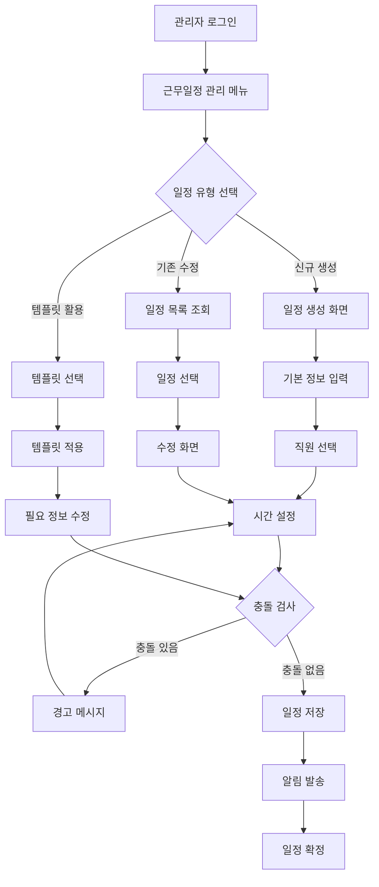

# ClockBox - PRD 세부 문서 : 근무일정

## 1. 개요 (Overview)
ClockBox의 근무일정(Schedule) 관리 기능을 정의한다.  
근무 스케줄 생성, 반복 일정, 교대근무, 휴게시간 규칙을 포함한다.

### 목적
- 다양한 근무제 대응 (정규, 교대, 유연, 재택)
- 근무일정 기반 리포트 및 정산 연동

---

## 2. UI Flow 다이어그램



### 화면 구성 예시

**일정 생성 화면**
```
┌─────────────────────────────────────┐
│ 근무일정 생성                        │
├─────────────────────────────────────┤
│ 부서: [드롭다운] 개발팀              │
│ 직원: [체크박스] □김철수 □이영희     │
│ 근무유형: ○정규 ○교대 ○재택         │
│ 시작일: [2024-03-01]               │
│ 종료일: [2024-03-31]               │
│ 시작시간: [09:00]                  │
│ 종료시간: [18:00]                  │
│ 휴게시간: [12:00-13:00]            │
│                                    │
│ [저장] [취소] [미리보기]            │
└─────────────────────────────────────┘
```

## 3. 사용자 시나리오 (User Flow)

### 시나리오 A: 기본 근무일정 생성
1. **관리자 로그인**: 시스템에 관리자 권한으로 접속
2. **메뉴 선택**: 근무일정 관리 메뉴 클릭
3. **신규 생성**: "신규 일정 생성" 버튼 클릭
4. **기본 정보 입력**: 부서, 근무유형, 기간 선택
5. **직원 배정**: 해당 일정에 배정할 직원 선택
6. **시간 설정**: 출근시간, 퇴근시간, 휴게시간 입력
7. **충돌 확인**: 시스템이 자동으로 중복 일정 검사
8. **저장 및 알림**: 일정 저장 후 해당 직원들에게 알림 발송

### 시나리오 B: 교대근무 일정 관리
1. **교대 템플릿 선택**: 미리 정의된 3교대 템플릿 선택
2. **교대 그룹 설정**: A조, B조, C조 직원 그룹 배정
3. **교대 시간 확인**: 오전 6-14시, 오후 14-22시, 야간 22-06시
4. **순환 패턴 설정**: 주 단위 교대 순환 규칙 적용
5. **예외 처리**: 휴가자, 병가자에 대한 대체 인력 배치
6. **월간 일정 생성**: 한 달치 교대 일정 자동 생성
7. **검토 및 확정**: 생성된 일정 검토 후 최종 확정

### 시나리오 C: 유연근무 일정 처리
1. **유연근무 신청 검토**: 직원의 재택근무, 시차출퇴근 신청 확인
2. **일정 조정**: 기존 일정에서 유연근무 적용 가능 여부 판단
3. **협업 일정 확인**: 팀 회의, 고객 미팅 등 필수 출근일 체크
4. **승인 처리**: 유연근무 일정 승인 및 캘린더 반영
5. **팀 공유**: 팀원들에게 변경된 일정 공유
6. **성과 모니터링**: 유연근무 적용 후 업무 성과 추적

---

## 4. 기능 정의 (Feature Definition)

### 핵심 일정 관리 기능
- **[FR-SCH-001] 기본 일정 생성 및 관리**
  - 일별, 주별, 월별 근무일정 생성
  - 드래그 앤 드롭 방식의 직관적 일정 편집
  - 근무시간, 휴게시간 설정
  - 일정 복사, 붙여넣기 기능
  
- **[FR-SCH-002] 근무 유형별 일정 지원**
  - 정규근무, 교대근무, 시차출퇴근 설정
  - 재택근무, 하이브리드 근무 일정 관리
  - 파트타임, 계약직 근무 패턴 지원
  - 프로젝트 기반 근무일정 생성

- **[FR-SCH-003] 반복 일정 및 템플릿**
  - 일간, 주간, 월간 반복 패턴 설정
  - 부서별, 직무별 일정 템플릿 제공
  - 교대근무 순환 패턴 자동 적용
  - 계절별, 프로젝트별 일정 템플릿

### 교대근무 및 특수근무 관리
- **[FR-SCH-004] 교대근무 시스템**
  - 2교대, 3교대 등 교대 패턴 설정
  - 교대조 편성 및 순환 규칙 적용
  - 야간근무, 주말근무 공정 배분
  - 교대 간 인수인계 시간 관리

- **[FR-SCH-005] 유연근무 지원**
  - 시차출퇴근제 시간대 설정
  - 재택근무일 지정 및 관리
  - 선택적 근무시간제 적용
  - 집약근무시간제 운영

### 일정 검증 및 관리
- **[FR-SCH-006] 일정 충돌 방지**
  - 동일 직원 중복 일정 감지
  - 근무시간 중첩 검사
  - 휴가, 병가와의 충돌 확인
  - 필수 참석 회의와의 겹침 방지

- **[FR-SCH-007] 근로기준법 준수 검증**
  - 주 52시간 근무시간 제한 확인
  - 연속 근무일 제한 검사
  - 휴게시간 의무 부여 확인
  - 야간근무, 휴일근무 규정 준수

### 🏭 한국 제조업 특화 교대근무 시스템
- **[FR-SCH-008] 3조3교대/4조2교대 지원**
  - **3조3교대**: 주간-오후-야간 순환 (8시간×3교대)
  - **4조2교대**: 주간-야간 2교대 (12시간×2교대, 2일 근무 2일 휴무)
  - **2조2교대**: 주간-야간 연속 2교대
  - **연속교대**: DuPont, Metropolitan 등 복잡한 패턴

- **[FR-SCH-009] 교대근무 법정 규정 준수**
  - **교대 간 최소 휴식**: 11시간 의무 휴식시간 보장
  - **연속 야간근무 제한**: 6일 연속 야간근무 금지
  - **교대조 공정성**: 각 조별 야간/휴일 근무 균등 배분
  - **교대 통지**: 근무표 1주일 전 사전 고지 의무

- **[FR-SCH-010] 예외상황 자동 처리**
  - **새벽 근무 일자 처리**: 00:00 전후 일자 경계 자동 처리
  - **해외 출장 시차**: 출장지 시간대 자동 계산 및 근무시간 조정
  - **다중 사업장**: 여러 사업장 근무자 통합 스케줄 관리
  - **파견근로자**: 파견처와 파견업체 이중 관리 체계

### 협업 및 연동 기능  
- **[FR-SCH-011] 캘린더 연동**
  - Google Calendar, Outlook 연동
  - 개인 캘린더와 근무일정 동기화
  - 팀 캘린더 공유 기능
  - 일정 변경 알림 자동 발송

- **[FR-SCH-012] 시스템 연동**
  - 출퇴근 기록 시스템과 연계
  - 급여 계산 시스템과 데이터 공유
  - 휴가 관리 시스템과 통합
  - 프로젝트 관리 도구와 연동

---

## 4. UI/UX 요구사항
### 직관적 스케줄 관리 인터페이스
- **다차원 캘린더 뷰**:
  - 일/주/월/분기/연간 뷰 즉시 전환
  - 간트 차트 스타일 타임라인 뷰
  - 히트맵 기반 업무량 시각화
  - 3D 스케줄 큐브 (시간×직원×장소)
- **고급 편집 기능**:
  - 멀티터치 드래그 앤 드롭
  - 일정 복사/붙여넣기/배치 복제
  - 실시간 충돌 방지 가이드라인
  - 음성 명령 일정 생성
- **기본 필터링 시스템**:
  - 기본 검색 기능 (부서, 직원, 날짜별)
  - 다중 조건 필터 조합
  - 자주 사용하는 필터 저장
  - 실시간 일정 업데이트

### 기본 스케줄링 대시보드
- **기본 배치 도구**:
  - 인력 배치 기본 가이드라인 제공
  - 비용 개요 보고서 기능
  - 직원 선호도 설정 반영
  - 기본 규정 준수 체크
- **실시간 모니터링**:
  - 스케줄 준수율 실시간 표시
  - 출근 현황 라이브 업데이트
  - 긴급 상황 대응 패널
  - 성과 지표 실시간 차트

### 협업 중심 인터페이스
- **팀 협업 도구**:
  - 일정 공유 및 댓글 시스템
  - 교대 인수인계 체크리스트
  - 팀 채팅 통합 스케줄 논의
  - 투표 기반 일정 결정
- **모바일 최적화**:
  - 터치 친화적 스케줄 편집
  - 스와이프 기반 빠른 액션
  - 오프라인 스케줄 조회
  - 위치 기반 자동 체크인/아웃

### 개인화 및 접근성
- **적응형 사용자 인터페이스**:
  - 사용 패턴 학습 기반 UI 최적화
  - 역할별 맞춤형 대시보드
  - 다크 모드 및 고대비 옵션
  - 15개 언어 완벽 지원
- **접근성 보장**:
  - 스크린 리더 완벽 호환
  - 키보드 단축키 네비게이션
  - 색맹 고려 색상 설계
  - 음성 피드백 지원

### 분석 및 인사이트 시각화
- **예측 분석 대시보드**:
  - 인력 수요 예측 그래프
  - 번아웃 위험 히트맵
  - 비용 트렌드 분석 차트
  - 만족도 변화 추이
- **인터랙티브 리포트**:
  - 드릴다운 가능한 성과 지표
  - 시나리오별 비교 분석
  - 실시간 데이터 슬라이싱
  - 커스텀 대시보드 구성

---

## 5. 비즈니스 규칙
- 동일 직원의 중복 일정 불가
- 휴게시간 자동 삽입
- 일정 확정 후 수정 시 로그 기록

---

## 6. 데이터 모델링 (초안)
### schedules 테이블
| 컬럼명 | 타입 | 설명 |
|--------|------|------|
| id | PK | 일정 ID |
| employee_id | FK(employees.id) | 직원 |
| start_time | datetime | 시작 |
| end_time | datetime | 종료 |
| type | enum(standard, shift, remote) | 근무 유형 |
| status | enum(confirmed, pending) | 상태 |

---

## 7. 알림 및 연동
- 일정 생성/변경 시 직원 알림
- 일정 확정 시 관리자 알림
- 캘린더 연동 (Google, Outlook)

---

## 8. 예외 및 에러 처리
| 케이스 | 조건 | 시스템 동작 | 사용자 메시지 |
|--------|------|------------|--------------|
| 중복 일정 | 동일 시간에 두 일정 | 저장 차단 | “중복 일정이 존재합니다.” |
| 잘못된 시간 | 종료 < 시작 | 저장 차단 | “종료 시간이 시작 시간보다 빠릅니다.” |
| 근로시간 초과 | 주52시간 초과 | 경고 표시 | “법정 근로시간을 초과합니다.” |

---

## 9. 연관성 (Dependency & Integration)
- **직원 (prd_employee.md)**: 직원 배정 필요
- **출퇴근기록 (prd_attendance.md)**: 일정 기반 출퇴근 인증
- **휴가 (prd_leave.md)**: 일정과 휴가 충돌 검증
- **정산 (prd_payroll.md)**: 일정 기반 급여 산출

---

## 10. 성공 지표 (KPI)
### 스케줄링 정확도 및 효율성
- **자동화 성능**:
  - 기본 일정 생성 성공률 ≥ 95%
  - 근무일정 충돌 검증 정확도 ≥ 99.5%
  - 기본 제안 채택률 ≥ 80%
  - 일정 확정 후 오류율 ≤ 0.5%
- **생성 효율성**:
  - 월간 스케줄 생성 시간 ≤ 30분 (100명 기준)
  - 대량 일정 처리 속도 ≥ 1000건/분
  - 실시간 충돌 감지 응답시간 ≤ 1초
  - 템플릿 활용률 ≥ 85%

### 직원 만족도 및 공정성
- **만족도 지표**:
  - 스케줄 만족도 ≥ 4.2/5.0
  - 선호 시간대 반영률 ≥ 75%
  - 워크-라이프 밸런스 점수 ≥ 4.0/5.0
  - 스케줄 변경 요청 승인률 ≥ 90%
- **공정성 평가**:
  - 교대 배정 공정성 지수 ≥ 95%
  - 초과근무 기회 균등 분배율 ≥ 90%
  - 휴일 근무 순환 공정성 ≥ 95%
  - 불만 제기율 ≤ 5%

### 비즈니스 임팩트 지표
- **비용 최적화**:
  - 인건비 절감률 ≥ 15% (기존 대비)
  - 초과근무비 최적화 ≥ 20%
  - 외부 인력 의존도 ≤ 10%
  - 스케줄링 관련 관리 비용 50% 절감
- **운영 효율성**:
  - 스케줄 준수율 ≥ 95%
  - 긴급 스케줄 변경 대응 시간 ≤ 15분
  - 출근율 개선 ≥ 98%
  - 생산성 향상 ≥ 20%

### 예측 정확도 및 적응성
- **예측 성능**:
  - 인력 수요 예측 정확도 ≥ 90%
  - 결근 예측 정확도 ≥ 85%
  - 번아웃 위험 조기 감지율 ≥ 80%
  - 계절적 변동 대응 정확도 ≥ 88%
- **적응 능력**:
  - 긴급 상황 대응 성공률 ≥ 95%
  - 새로운 근무 패턴 학습 속도 ≤ 2주
  - 시장 변화 대응 시간 ≤ 3일
  - 규제 변경 자동 적용률 100%

### 시스템 성능 및 안정성
- **기술적 성능**:
  - 스케줄 시스템 가용성 ≥ 99.8%
  - 동시 사용자 5000명 지원
  - 데이터 백업 성공률 100%
  - 보안 사고 발생률 0건
- **사용자 경험**:
  - 모바일 앱 사용률 ≥ 80%
  - 사용자 인터페이스 만족도 ≥ 4.5/5.0
  - 기능 발견율 ≥ 70% (신규 기능)
  - 지원 문의 감소율 ≥ 40%

### 법적 준수 및 리스크 관리
- **컴플라이언스**:
  - 근로기준법 위반 사전 방지율 100%
  - 단체협약 준수율 100%
  - 안전 규정 준수율 100%
  - 감사 대응 완료 시간 ≤ 24시간
- **리스크 관리**:
  - 핵심 인력 부재 시나리오 대비율 ≥ 95%
  - 스케줄 관련 분쟁 발생률 ≤ 2%
  - 데이터 유실 방지율 100%
  - 재해 복구 시간 ≤ 4시간

## 10-1. 고급 분석 및 벤치마킹
### 업계 비교 분석
- **효율성 벤치마크**: 동종 업계 대비 스케줄링 효율성 상위 10%
- **혁신 지수**: 스케줄링 기술 혁신도 업계 평균 대비 150%
- **만족도 순위**: 직원 만족도 업계 상위 5%
- **ROI 성과**: 스케줄링 투자 대비 수익률 업계 평균 대비 200%

### 미래 준비도 평가
- **시스템 활용도**: 기본 기능 활용률 측정
- **확장성**: 조직 성장에 따른 시스템 확장 준비도
- **기술 트렌드 대응**: 신기술 도입 속도 및 적응력
- **글로벌 준비도**: 다국가 운영 지원 능력
