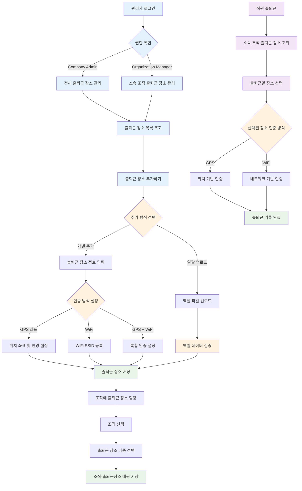
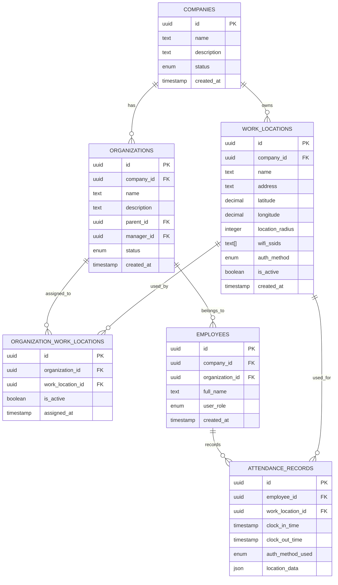

# ClockBox - PRD 세부 문서 : 출퇴근 장소 관리 ⚠️ 구현 대기

## 1. 개요 (Overview)
ClockBox의 출퇴근 장소(Work Location) 관리 시스템을 정의합니다.  
GPS/WiFi 기반 위치 인증과 조직별 출퇴근 장소 할당을 통해 정확한 출퇴근 기록을 지원합니다.

### 목적
- **조직별 출퇴근 장소 관리**: 회사-조직 계층에 맞는 근무지 설정
- **다중 인증 방식 지원**: GPS 좌표, WiFi 네트워크 기반 위치 인증
- **유연한 근무환경 대응**: 재택근무, 현장근무, 하이브리드 근무 지원
- **법규 준수 지원**: 정확한 근무지 기록으로 노동법 컴플라이언스 강화

### 연관 시스템
- **조직 관리 시스템** (`prd_org.md`): 조직 계층 구조와 완전 통합
- **출퇴근기록 시스템** (`prd_attendance.md`): 위치 기반 출퇴근 인증 연동
- **권한 관리 시스템** (`prd_role.md`): 4-tier RBAC 기반 접근 제어

---

## 2. UI Flow 다이어그램



### 화면 구성도
```
┌──────────────────────────────────────┐
│           출퇴근 장소 관리            │
├──────────────────────────────────────┤
│ [다운로드] [업로드]    [+ 출퇴근 장소 추가하기] │
├──────────────────────────────────────┤
│ 검색: [_____________] [🔍]           │
├──────────────────────────────────────┤
│ ☐ 출퇴근장소 | 근무지 주소    | 좌표    | WiFi | 메모 │
│ ☐ 본사      | 서울시 강남구  | 37.5475 | O   │     │
│ ☐ 지점1     | 부산시 해운대  | 35.1595 | X   │     │  
│ ☐ 현장사무소 | 대구시 중구   | 35.8714 | O   │     │
└──────────────────────────────────────┘
```

## 3. 출퇴근 장소 목록 조회

### 3.1 접근 권한 및 경로
- **접근 경로**: 관리 > 출퇴근 장소
- **Company Admin**: 회사 전체 출퇴근 장소 조회/관리
- **Organization Manager**: 소속 조직의 출퇴근 장소 조회/관리

### 3.2 화면 구성
- **출퇴근 장소 목록 테이블**
  - 출퇴근 장소명: 근무지 이름
  - 근무지 주소: 도로명 주소
  - 좌표 정보: GPS 위경도 좌표 (설정된 경우)
  - WiFi 설정 여부: WiFi 인증 사용 여부
  - 메모: 추가 설명

### 3.3 기능
- **목록 조회**: 권한에 따른 출퇴근 장소 목록 표시
- **검색/필터링**: 장소명, 주소 기반 검색
- **정렬**: 생성일, 이름순 정렬
- **수정/삭제**: 개별 출퇴근 장소 관리

## 4. 출퇴근 장소 추가

### 4.1 접근 방법
1. **개별 추가**: 우측 상단 "출퇴근 장소 추가하기" 버튼
2. **일괄 추가**: 좌측 "업로드" 버튼을 통한 엑셀 파일 업로드

### 4.2 출퇴근 장소 정보 입력

#### 4.2.1 기본 정보
- **출퇴근 장소명** (필수)
  - 출퇴근 장소의 이름
  - 예: "본사", "지점1", "현장사무소" 등

- **근무지 주소** (필수)
  - 도로명 주소 입력
  - 주소 검색 기능 제공

#### 4.2.2 출퇴근 수단 선택

##### A. 좌표 설정
- **기능**: GPS 좌표 기반 출퇴근 인증
- **설정 내용**:
  - 기준 좌표 설정
  - 인증 가능 반경 조정 (미터 단위)
- **사용 시나리오**: 야외 현장, 고정된 사무실 위치
- **추가 설정**: 출퇴근 장소 - 좌표 설정하기 참조

##### B. WiFi 설정  
- **기능**: 근무지 내 WiFi 네트워크 기반 출퇴근 인증
- **설정 내용**:
  - WiFi SSID 등록
  - 복수 WiFi 네트워크 등록 가능
- **사용 시나리오**: 실내 사무실, WiFi가 구축된 근무 환경
- **추가 설정**: 출퇴근 장소 - WiFi 설정하기 참조

## 5. 조직에 출퇴근 장소 설정

### 5.1 조직별 출퇴근 장소 할당

#### 4.1.1 접근 방법
1. **접근 경로**: 관리 > 조직 메뉴로 이동
2. 목록에서 출퇴근 장소를 설정할 조직을 선택

#### 4.1.2 조직 수정 화면
- **조직명**: 조직 이름 입력/수정
- **출퇴근 장소들**: 다중 선택 가능한 출퇴근 장소 목록
  - 체크박스를 통한 복수 선택 지원
  - 기존에 등록된 출퇴근 장소 중에서 선택
  - 검색 기능을 통한 출퇴근 장소 필터링

#### 4.1.3 다중 출퇴근 장소 설정
- **기능**: 한 개의 조직에 여러 개의 출퇴근 장소 할당 가능
- **직원 사용**: 출퇴근 시 할당된 장소 중에서 선택하여 기록
- **예시 설정**:
  - 선릉점, 역삼점, 재택근무 (체크됨)
  - 출퇴근 장소 - 경영본부실 (체크 안됨)
  - 출퇴근 장소 - 경영지원 (체크 안됨)

#### 4.1.4 출퇴근 장소 선택 UI
- **메모 입력란**: 출퇴근 장소 설정에 대한 추가 설명
- **검색 기능**: 출퇴근 장소명으로 필터링
- **선택 상태 표시**: 체크박스로 할당 여부 확인
- **저장 기능**: "변경사항 저장" 버튼으로 설정 완료

### 4.2 조직-출퇴근장소 매핑 관리

#### 4.2.1 데이터베이스 관계 설계
```sql
-- 조직-출퇴근장소 매핑 테이블
organization_work_locations (
  id UUID PRIMARY KEY,
  organization_id UUID REFERENCES organizations(id),
  work_location_id UUID REFERENCES work_locations(id),
  is_active BOOLEAN DEFAULT true,
  assigned_at TIMESTAMP DEFAULT NOW(),
  UNIQUE(organization_id, work_location_id)
);
```

#### 4.2.2 API 확장
- `GET /api/organizations/:id/work-locations` - 조직의 출퇴근 장소 목록 조회
- `PUT /api/organizations/:id/work-locations` - 조직의 출퇴근 장소 할당 업데이트
- `GET /api/work-locations/by-organization/:orgId` - 조직별 사용 가능한 출퇴근 장소

### 4.3 직원 출퇴근 시 장소 선택

#### 4.3.1 출퇴근 기록 프로세스
1. 직원이 출퇴근 기록 시도
2. 소속 조직에 할당된 출퇴근 장소 목록 조회
3. 직원이 출퇴근할 장소 선택
4. 선택한 장소의 인증 방식에 따라 출퇴근 기록
   - GPS 좌표: 위치 기반 인증
   - WiFi: 네트워크 기반 인증

#### 5.3.2 사용자 경험 개선
- **최근 사용 장소 우선 표시**: 자주 사용하는 출퇴근 장소 상단 배치
- **즐겨찾기 기능**: 개인별 선호 출퇴근 장소 저장
- **자동 선택 옵션**: 동일한 장소에서 연속 출퇴근 시 자동 선택

## 6. 기술 구현 사항

### 6.1 데이터베이스 설계
```sql
-- 출퇴근 장소 테이블
work_locations (
  id UUID PRIMARY KEY,
  company_id UUID REFERENCES companies(id),
  organization_id UUID REFERENCES organizations(id),
  name VARCHAR(100) NOT NULL,
  address TEXT NOT NULL,
  latitude DECIMAL(10,8),
  longitude DECIMAL(11,8),
  location_radius INTEGER DEFAULT 100,
  wifi_ssids TEXT[],
  auth_method VARCHAR(20) CHECK (auth_method IN ('gps', 'wifi', 'both')),
  is_active BOOLEAN DEFAULT true,
  created_at TIMESTAMP DEFAULT NOW(),
  updated_at TIMESTAMP DEFAULT NOW()
);
```

### 6.2 API 엔드포인트
- `GET /api/work-locations` - 출퇴근 장소 목록 조회
- `POST /api/work-locations` - 출퇴근 장소 추가
- `PUT /api/work-locations/:id` - 출퇴근 장소 수정
- `DELETE /api/work-locations/:id` - 출퇴근 장소 삭제
- `POST /api/work-locations/bulk-upload` - 엑셀 일괄 업로드

### 6.3 권한 제어
- Company Admin: 회사 전체 출퇴근 장소 관리
- Organization Manager: 소속 조직의 출퇴근 장소 관리
- 데이터 접근: RLS 정책으로 company_id/organization_id 기반 제한

## 7. 사용자 시나리오

### 7.1 본사 사무실 등록
1. 출퇴근 장소명: "본사"
2. 주소: "서울특별시 강남구 테헤란로 123"
3. 출퇴근 수단: WiFi 선택
4. WiFi SSID: "Company-WiFi", "Company-Guest" 등록

### 7.2 현장 사무소 등록
1. 출퇴근 장소명: "건설현장1"
2. 주소: "부산광역시 해운대구 해운대로 456"
3. 출퇴근 수단: 좌표 선택
4. 인증 반경: 50미터 설정

### 7.3 하이브리드 근무지 등록
1. 출퇴근 장소명: "지점사무소"
2. 주소: "대구광역시 중구 동성로 789"
3. 출퇴근 수단: 좌표 + WiFi 복합 설정

### 7.4 조직별 출퇴근 장소 할당 시나리오
1. 관리 > 조직에서 "마케팅팀" 선택
2. 출퇴근 장소들에서 다음 항목 체크:
   - 선릉점 ✓
   - 역삼점 ✓  
   - 재택근무 ✓
3. 메모 입력: "마케팅팀 하이브리드 근무 환경"
4. 변경사항 저장

---

## 8. 데이터 모델링 및 비즈니스 로직

### 8.1 주요 엔티티 및 관계



### 8.2 비즈니스 규칙
- **계층적 접근 제어**: Company → Organization → WorkLocation 계층 구조
- **중복 방지**: 동일 조직 내 출퇴근 장소명 중복 불가
- **매핑 무결성**: 하나의 조직은 여러 출퇴근 장소를 가질 수 있음
- **인증 예비 체계**: GPS 인증 실패 시 WiFi 보조 인증 지원

---

## 9. 유효성 검증

### 9.1 입력 검증
- 출퇴근 장소명: 필수 입력, 100자 이내
- 주소: 필수 입력, 유효한 도로명 주소
- 좌표: 위도/경도 범위 검증
- WiFi SSID: 유효한 네트워크 이름 형식

### 9.2 비즈니스 규칙
- 같은 조직 내 출퇴근 장소명 중복 불가
- 최소 하나의 출퇴근 수단 선택 필수
- 좌표 반경: 10m ~ 1000m 범위 제한

---

## 10. 구현 우선순위 및 로드맵

### 10.1 Phase 1: 핵심 기능 (MVP)
- [x] **조직 관리 시스템 연동**: 기존 조직 구조와 완전 통합
- [ ] **출퇴근 장소 CRUD**: 기본적인 생성, 조회, 수정, 삭제
- [ ] **GPS 좌표 기반 인증**: 위치 기반 출퇴근 기록
- [ ] **조직별 출퇴근 장소 할당**: 다중 선택 및 매핑

### 10.2 Phase 2: 고급 기능
- [ ] **WiFi 기반 인증**: 네트워크 SSID 기반 위치 인증
- [ ] **일괄 업로드**: 엑셀 파일을 통한 출퇴근 장소 대량 등록
- [ ] **사용자 경험 개선**: 즐겨찾기, 최근 사용 장소 우선 표시

### 10.3 Phase 3: 확장 기능
- [ ] **QR 코드 인증**: QR 코드 스캔 기반 출퇴근 기록
- [ ] **외부 API 연동**: Google Maps, 네이버 지도 주소 검색
- [ ] **고급 분석**: 출퇴근 패턴 분석 및 리포팅

### 10.4 연관 시스템 의존성
- **필수 의존성**: 조직 관리 시스템 (`prd_org.md`) - 구현 완료 ✅
- **통합 의존성**: 출퇴근기록 시스템 (`prd_attendance.md`) - 위치 인증 로직
- **권한 의존성**: 역할 관리 시스템 (`prd_role.md`) - 4-tier RBAC 연동

---

## 11. 기술적 고려사항

### 11.1 성능 최적화
- **지리적 인덱싱**: PostgreSQL PostGIS 확장을 통한 공간 인덱스
- **캐싱 전략**: 자주 조회되는 출퇴근 장소 정보 Redis 캐싱
- **배치 처리**: 대량의 위치 데이터 처리를 위한 비동기 큐 시스템

### 11.2 보안 및 개인정보
- **위치 데이터 암호화**: 저장 시 AES-256 암호화
- **데이터 최소화**: 필요한 정밀도만 저장 (100m 단위 반올림)
- **접근 로그**: 위치 정보 접근 이력 3년간 보관

### 11.3 호환성 및 확장성
- **모바일 우선**: PWA 기반 모바일 최적화
- **브라우저 지원**: Chrome, Safari, Firefox 최신 2버전
- **API 버저닝**: REST API v1 명세 및 하위 호환성 보장

---

## 12. 확장 계획

### 12.1 추가 예정 기능
- **IoT 센서 연동**: 스마트 도어락, 출입카드 시스템 통합
- **AI 기반 패턴 분석**: 비정상 출퇴근 패턴 자동 감지
- **다국어 지원**: 영어, 일본어, 중국어 지원

### 12.2 외부 연동 확장
- **지도 서비스**: Google Maps, 네이버 지도, 카카오맵 API
- **교통 정보**: 실시간 교통상황 기반 출퇴근 예상 시간
- **날씨 연동**: 기상 조건에 따른 출퇴근 정책 자동 적용

